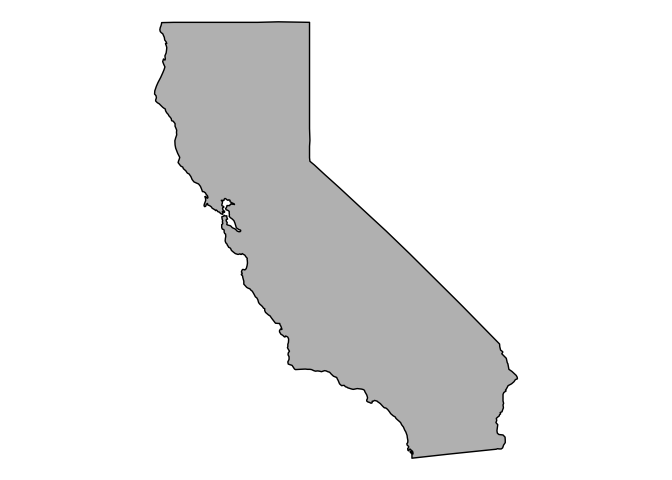
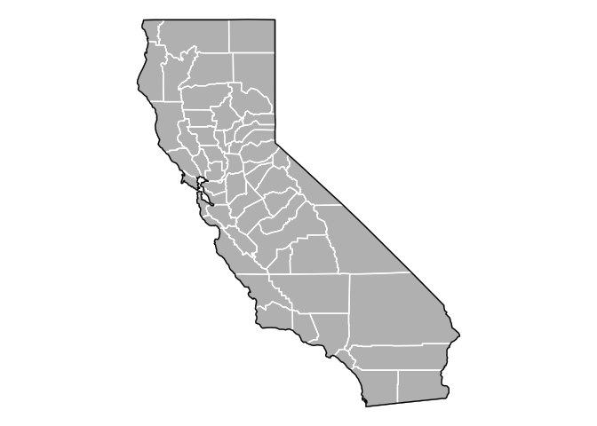

Lab17
================
Karen Guerrero

``` r
# Import vaccination data
vax <- read.csv("Statewide.csv")
```

\#Q1. What column details the total number of people fully vaccinated?
persons_fully_vaccinated

\#Q2. What column details the Zip code tabulation area?
zip_code_tabulation_area

\#Q3. What is the earliest date in this dataset? 2021-01-05

\#Q4. What is the latest date in this dataset? 2022-11-22

``` r
head(vax)
```

      as_of_date zip_code_tabulation_area local_health_jurisdiction          county
    1 2021-01-05                    92240                 Riverside       Riverside
    2 2021-01-05                    91302               Los Angeles     Los Angeles
    3 2021-01-05                    93420           San Luis Obispo San Luis Obispo
    4 2021-01-05                    91901                 San Diego       San Diego
    5 2021-01-05                    94110             San Francisco   San Francisco
    6 2021-01-05                    91902                 San Diego       San Diego
      vaccine_equity_metric_quartile                 vem_source
    1                              1 Healthy Places Index Score
    2                              4 Healthy Places Index Score
    3                              3 Healthy Places Index Score
    4                              3 Healthy Places Index Score
    5                              4 Healthy Places Index Score
    6                              4 Healthy Places Index Score
      age12_plus_population age5_plus_population tot_population
    1               29270.5                33093          35278
    2               23163.9                25899          26712
    3               26694.9                29253          30740
    4               15549.8                16905          18162
    5               64350.7                68320          72380
    6               16620.7                18026          18896
      persons_fully_vaccinated persons_partially_vaccinated
    1                       NA                           NA
    2                       15                          614
    3                       NA                           NA
    4                       NA                           NA
    5                       17                         1268
    6                       15                          397
      percent_of_population_fully_vaccinated
    1                                     NA
    2                               0.000562
    3                                     NA
    4                                     NA
    5                               0.000235
    6                               0.000794
      percent_of_population_partially_vaccinated
    1                                         NA
    2                                   0.022986
    3                                         NA
    4                                         NA
    5                                   0.017519
    6                                   0.021010
      percent_of_population_with_1_plus_dose booster_recip_count
    1                                     NA                  NA
    2                               0.023548                  NA
    3                                     NA                  NA
    4                                     NA                  NA
    5                               0.017754                  NA
    6                               0.021804                  NA
      bivalent_dose_recip_count eligible_recipient_count
    1                        NA                        2
    2                        NA                       15
    3                        NA                        4
    4                        NA                        8
    5                        NA                       17
    6                        NA                       15
                                                                   redacted
    1 Information redacted in accordance with CA state privacy requirements
    2 Information redacted in accordance with CA state privacy requirements
    3 Information redacted in accordance with CA state privacy requirements
    4 Information redacted in accordance with CA state privacy requirements
    5 Information redacted in accordance with CA state privacy requirements
    6 Information redacted in accordance with CA state privacy requirements

``` r
tail(vax)
```

           as_of_date zip_code_tabulation_area local_health_jurisdiction
    174631 2022-11-22                    94066                 San Mateo
    174632 2022-11-22                    92254                 Riverside
    174633 2022-11-22                    94065                 San Mateo
    174634 2022-11-22                    92280            San Bernardino
    174635 2022-11-22                    94929                     Marin
    174636 2022-11-22                    92313            San Bernardino
                   county vaccine_equity_metric_quartile                 vem_source
    174631      San Mateo                              4 Healthy Places Index Score
    174632      Riverside                              1 Healthy Places Index Score
    174633      San Mateo                              4 Healthy Places Index Score
    174634 San Bernardino                             NA            No VEM Assigned
    174635          Marin                              4    CDPH-Derived ZCTA Score
    174636 San Bernardino                              2 Healthy Places Index Score
           age12_plus_population age5_plus_population tot_population
    174631               37730.3                40903          43101
    174632                7882.3                 8985           9779
    174633               10465.5                11778          12461
    174634                   0.0                    0             NA
    174635                 174.2                  218            254
    174636               10842.9                11847          12547
           persons_fully_vaccinated persons_partially_vaccinated
    174631                    38105                         2889
    174632                     9456                         1688
    174633                    11238                          889
    174634                       NA                           NA
    174635                       NA                           NA
    174636                     7948                          600
           percent_of_population_fully_vaccinated
    174631                               0.884086
    174632                               0.966970
    174633                               0.901854
    174634                                     NA
    174635                                     NA
    174636                               0.633458
           percent_of_population_partially_vaccinated
    174631                                   0.067029
    174632                                   0.172615
    174633                                   0.071343
    174634                                         NA
    174635                                         NA
    174636                                   0.047820
           percent_of_population_with_1_plus_dose booster_recip_count
    174631                               0.951115               27085
    174632                               1.000000                3840
    174633                               0.973197                8701
    174634                                     NA                  NA
    174635                                     NA                  NA
    174636                               0.681278                4522
           bivalent_dose_recip_count eligible_recipient_count
    174631                      9127                    37620
    174632                       372                     9430
    174633                      3456                    11021
    174634                        NA                       14
    174635                        NA                      159
    174636                      1085                     7921
                                                                        redacted
    174631                                                                    No
    174632                                                                    No
    174633                                                                    No
    174634 Information redacted in accordance with CA state privacy requirements
    174635 Information redacted in accordance with CA state privacy requirements
    174636                                                                    No

\#Q5. How many numeric columns are in this dataset? 13

``` r
skimr::skim(vax)
```

|                                                  |        |
|:-------------------------------------------------|:-------|
| Name                                             | vax    |
| Number of rows                                   | 174636 |
| Number of columns                                | 18     |
| \_\_\_\_\_\_\_\_\_\_\_\_\_\_\_\_\_\_\_\_\_\_\_   |        |
| Column type frequency:                           |        |
| character                                        | 5      |
| numeric                                          | 13     |
| \_\_\_\_\_\_\_\_\_\_\_\_\_\_\_\_\_\_\_\_\_\_\_\_ |        |
| Group variables                                  | None   |

Data summary

**Variable type: character**

| skim_variable             | n_missing | complete_rate | min | max | empty | n_unique | whitespace |
|:--------------------------|----------:|--------------:|----:|----:|------:|---------:|-----------:|
| as_of_date                |         0 |             1 |  10 |  10 |     0 |       99 |          0 |
| local_health_jurisdiction |         0 |             1 |   0 |  15 |   495 |       62 |          0 |
| county                    |         0 |             1 |   0 |  15 |   495 |       59 |          0 |
| vem_source                |         0 |             1 |  15 |  26 |     0 |        3 |          0 |
| redacted                  |         0 |             1 |   2 |  69 |     0 |        2 |          0 |

**Variable type: numeric**

| skim_variable                              | n_missing | complete_rate |     mean |       sd |    p0 |      p25 |      p50 |      p75 |     p100 | hist  |
|:-------------------------------------------|----------:|--------------:|---------:|---------:|------:|---------:|---------:|---------:|---------:|:------|
| zip_code_tabulation_area                   |         0 |          1.00 | 93665.11 |  1817.39 | 90001 | 92257.75 | 93658.50 | 95380.50 |  97635.0 | ▃▅▅▇▁ |
| vaccine_equity_metric_quartile             |      8613 |          0.95 |     2.44 |     1.11 |     1 |     1.00 |     2.00 |     3.00 |      4.0 | ▇▇▁▇▇ |
| age12_plus_population                      |         0 |          1.00 | 18895.04 | 18993.88 |     0 |  1346.95 | 13685.10 | 31756.12 |  88556.7 | ▇▃▂▁▁ |
| age5_plus_population                       |         0 |          1.00 | 20875.24 | 21105.98 |     0 |  1460.50 | 15364.00 | 34877.00 | 101902.0 | ▇▃▂▁▁ |
| tot_population                             |      8514 |          0.95 | 23372.77 | 22628.51 |    12 |  2126.00 | 18714.00 | 38168.00 | 111165.0 | ▇▅▂▁▁ |
| persons_fully_vaccinated                   |     14921 |          0.91 | 13466.34 | 14722.46 |    11 |   883.00 |  8024.00 | 22529.00 |  87186.0 | ▇▃▁▁▁ |
| persons_partially_vaccinated               |     14921 |          0.91 |  1707.50 |  1998.80 |    11 |   167.00 |  1194.00 |  2547.00 |  39204.0 | ▇▁▁▁▁ |
| percent_of_population_fully_vaccinated     |     18665 |          0.89 |     0.55 |     0.25 |     0 |     0.39 |     0.59 |     0.73 |      1.0 | ▃▃▆▇▃ |
| percent_of_population_partially_vaccinated |     18665 |          0.89 |     0.08 |     0.09 |     0 |     0.05 |     0.06 |     0.08 |      1.0 | ▇▁▁▁▁ |
| percent_of_population_with_1\_plus_dose    |     19562 |          0.89 |     0.61 |     0.25 |     0 |     0.46 |     0.65 |     0.79 |      1.0 | ▂▂▆▇▆ |
| booster_recip_count                        |     70421 |          0.60 |  5655.17 |  6867.49 |    11 |   280.00 |  2575.00 |  9421.00 |  58304.0 | ▇▂▁▁▁ |
| bivalent_dose_recip_count                  |    156958 |          0.10 |  1646.02 |  2161.84 |    11 |   109.00 |   719.00 |  2443.00 |  18109.0 | ▇▁▁▁▁ |
| eligible_recipient_count                   |         0 |          1.00 | 12309.19 | 14555.83 |     0 |   466.00 |  5810.00 | 21140.00 |  86696.0 | ▇▂▁▁▁ |

``` r
sum(is.na(vax$persons_fully_vaccinated))
```

    [1] 14921

``` r
library(lubridate)
```

    Loading required package: timechange


    Attaching package: 'lubridate'

    The following objects are masked from 'package:base':

        date, intersect, setdiff, union

``` r
today()
```

    [1] "2022-12-02"

``` r
# This will give an Error!
##today() - vax$as_of_date[1]
```

``` r
# Specify that we are using the year-month-day format
vax$as_of_date <- ymd(vax$as_of_date)
```

``` r
today() - vax$as_of_date[1]
```

    Time difference of 696 days

``` r
vax$as_of_date[nrow(vax)] - vax$as_of_date[1]
```

    Time difference of 686 days

``` r
library(zipcodeR)
```

``` r
geocode_zip('92037')
```

    # A tibble: 1 × 3
      zipcode   lat   lng
      <chr>   <dbl> <dbl>
    1 92037    32.8 -117.

``` r
zip_distance('92037','92109')
```

      zipcode_a zipcode_b distance
    1     92037     92109     2.33

``` r
reverse_zipcode(c('92037', "92109") )
```

    # A tibble: 2 × 24
      zipcode zipcode_…¹ major…² post_…³ common_c…⁴ county state   lat   lng timez…⁵
      <chr>   <chr>      <chr>   <chr>       <blob> <chr>  <chr> <dbl> <dbl> <chr>  
    1 92037   Standard   La Jol… La Jol… <raw 20 B> San D… CA     32.8 -117. Pacific
    2 92109   Standard   San Di… San Di… <raw 21 B> San D… CA     32.8 -117. Pacific
    # … with 14 more variables: radius_in_miles <dbl>, area_code_list <blob>,
    #   population <int>, population_density <dbl>, land_area_in_sqmi <dbl>,
    #   water_area_in_sqmi <dbl>, housing_units <int>,
    #   occupied_housing_units <int>, median_home_value <int>,
    #   median_household_income <int>, bounds_west <dbl>, bounds_east <dbl>,
    #   bounds_north <dbl>, bounds_south <dbl>, and abbreviated variable names
    #   ¹​zipcode_type, ²​major_city, ³​post_office_city, ⁴​common_city_list, …

``` r
# Pull data for all ZIP codes in the dataset
zipdata <- reverse_zipcode( vax$zip_code_tabulation_area )
```

``` r
#vax$county == "San Diego"
```

``` r
library(ggplot2)
library(ggmap)
```

    ℹ Google's Terms of Service: <]8;;https://mapsplatform.google.comhttps://mapsplatform.google.com]8;;>

    ℹ Please cite ggmap if you use it! Use `citation("ggmap")` for details.

``` r
library(maps)
library(mapdata)
```

``` r
usa <- map_data("usa")
```

``` r
dim(usa)
```

    [1] 7243    6

``` r
head(usa)
```

           long      lat group order region subregion
    1 -101.4078 29.74224     1     1   main      <NA>
    2 -101.3906 29.74224     1     2   main      <NA>
    3 -101.3620 29.65056     1     3   main      <NA>
    4 -101.3505 29.63911     1     4   main      <NA>
    5 -101.3219 29.63338     1     5   main      <NA>
    6 -101.3047 29.64484     1     6   main      <NA>

``` r
tail(usa)
```

              long      lat group order         region subregion
    7247 -122.6187 48.37482    10  7247 whidbey island      <NA>
    7248 -122.6359 48.35764    10  7248 whidbey island      <NA>
    7249 -122.6703 48.31180    10  7249 whidbey island      <NA>
    7250 -122.7218 48.23732    10  7250 whidbey island      <NA>
    7251 -122.7104 48.21440    10  7251 whidbey island      <NA>
    7252 -122.6703 48.17429    10  7252 whidbey island      <NA>

``` r
states <- map_data("state")
cali <- subset(states, region %in% c("california"))
```

``` r
ggplot(data = cali) + 
  geom_polygon(aes(x = long, y = lat, group = group), fill = "palegreen", color = "black") + 
  coord_fixed(1.3)
```


``` r
ca_df <- subset(states, region == "california")
```

``` r
counties <- map_data("county")
```

``` r
ca_county <- subset(counties, region == "california")
```

``` r
ca_base <- ggplot(data = ca_df, mapping = aes(x = long, y = lat, group = group)) + 
  coord_fixed(1.3) + 
  geom_polygon(color = "black", fill = "gray")
ca_base + theme_nothing()
```



``` r
ca_base + theme_nothing() + 
  geom_polygon(data = ca_county, fill = NA, color = "white") +
  geom_polygon(color = "black", fill = NA)  # get the state border back on top
```



``` r
library(stringr)
```

``` r
# make a data frame
    x <- readLines("population.txt")
```

    Warning in readLines("population.txt"): incomplete final line found on
    'population.txt'

``` r
    pop_and_area <- str_match(x, "^([a-zA-Z ]+)County\t.*\t([0-9,]{2,10})\t([0-9,]{2,10}) sq mi$")[, -1] %>%
      na.omit() %>%
      str_replace_all(",", "") %>% 
      str_trim() %>%
      tolower() %>%
      as.data.frame(stringsAsFactors = FALSE)
```

``` r
View(x)
```

``` r
    # give names and make population and area numeric
    #names(pop_and_area) <- c("subregion", "population", "area")
    #pop_and_area$population <- as.numeric(pop_and_area$population)
    #pop_and_area$area <- as.numeric(pop_and_area$area)
```

``` r
library(dplyr)
```


    Attaching package: 'dplyr'

    The following objects are masked from 'package:stats':

        filter, lag

    The following objects are masked from 'package:base':

        intersect, setdiff, setequal, union

``` r
sd <- filter(vax, county == "San Diego")
```

``` r
nrow(sd)
```

    [1] 10593

``` r
sd.10 <- filter(vax, county == "San Diego" &
                age5_plus_population > 10000)
```

``` r
unique(sd.10$zip_code_tabulation_area)
```

     [1] 91901 91902 92081 92130 92126 92069 92064 91945 91941 91911 92010 92019
    [13] 92011 92055 92058 92123 92139 92173 92117 92078 91913 91942 91914 91932
    [25] 91950 92131 92102 91910 92115 92120 92122 92154 92114 92009 92014 92029
    [37] 92057 92082 92124 92026 92104 92084 92083 92075 92118 92116 92113 92103
    [49] 92056 92054 92040 91977 91915 92105 92107 92021 92024 92028 92065 92008
    [61] 92007 92037 92020 92025 92027 92128 92106 92108 92109 92119 92127 92129
    [73] 92101 92071 92110 92111

``` r
sd.10[!duplicated(sd.10$zip_code_tabulation_area), ]
```

       as_of_date zip_code_tabulation_area local_health_jurisdiction    county
    1  2021-01-05                    91901                 San Diego San Diego
    2  2021-01-05                    91902                 San Diego San Diego
    3  2021-01-05                    92081                 San Diego San Diego
    4  2021-01-05                    92130                 San Diego San Diego
    5  2021-01-05                    92126                 San Diego San Diego
    6  2021-01-05                    92069                 San Diego San Diego
    7  2021-01-05                    92064                 San Diego San Diego
    8  2021-01-05                    91945                 San Diego San Diego
    9  2021-01-05                    91941                 San Diego San Diego
    10 2021-01-05                    91911                 San Diego San Diego
    11 2021-01-05                    92010                 San Diego San Diego
    12 2021-01-05                    92019                 San Diego San Diego
    13 2021-01-05                    92011                 San Diego San Diego
    14 2021-01-05                    92055                 San Diego San Diego
    15 2021-01-05                    92058                 San Diego San Diego
    16 2021-01-05                    92123                 San Diego San Diego
    17 2021-01-05                    92139                 San Diego San Diego
    18 2021-01-05                    92173                 San Diego San Diego
    19 2021-01-05                    92117                 San Diego San Diego
    20 2021-01-05                    92078                 San Diego San Diego
    21 2021-01-05                    91913                 San Diego San Diego
    22 2021-01-05                    91942                 San Diego San Diego
    23 2021-01-05                    91914                 San Diego San Diego
    24 2021-01-05                    91932                 San Diego San Diego
    25 2021-01-05                    91950                 San Diego San Diego
    26 2021-01-05                    92131                 San Diego San Diego
    27 2021-01-05                    92102                 San Diego San Diego
    28 2021-01-05                    91910                 San Diego San Diego
    29 2021-01-05                    92115                 San Diego San Diego
    30 2021-01-05                    92120                 San Diego San Diego
    31 2021-01-05                    92122                 San Diego San Diego
    32 2021-01-05                    92154                 San Diego San Diego
    33 2021-01-05                    92114                 San Diego San Diego
    34 2021-01-05                    92009                 San Diego San Diego
    35 2021-01-05                    92014                 San Diego San Diego
    36 2021-01-05                    92029                 San Diego San Diego
    37 2021-01-05                    92057                 San Diego San Diego
    38 2021-01-05                    92082                 San Diego San Diego
    39 2021-01-05                    92124                 San Diego San Diego
    40 2021-01-05                    92026                 San Diego San Diego
    41 2021-01-05                    92104                 San Diego San Diego
    42 2021-01-05                    92084                 San Diego San Diego
    43 2021-01-05                    92083                 San Diego San Diego
    44 2021-01-05                    92075                 San Diego San Diego
    45 2021-01-05                    92118                 San Diego San Diego
    46 2021-01-05                    92116                 San Diego San Diego
    47 2021-01-05                    92113                 San Diego San Diego
    48 2021-01-05                    92103                 San Diego San Diego
    49 2021-01-05                    92056                 San Diego San Diego
    50 2021-01-05                    92054                 San Diego San Diego
    51 2021-01-05                    92040                 San Diego San Diego
    52 2021-01-05                    91977                 San Diego San Diego
    53 2021-01-05                    91915                 San Diego San Diego
    54 2021-01-05                    92105                 San Diego San Diego
    55 2021-01-05                    92107                 San Diego San Diego
    56 2021-01-05                    92021                 San Diego San Diego
    57 2021-01-05                    92024                 San Diego San Diego
    58 2021-01-05                    92028                 San Diego San Diego
    59 2021-01-05                    92065                 San Diego San Diego
    60 2021-01-05                    92008                 San Diego San Diego
    61 2021-01-05                    92007                 San Diego San Diego
    62 2021-01-05                    92037                 San Diego San Diego
    63 2021-01-05                    92020                 San Diego San Diego
    64 2021-01-05                    92025                 San Diego San Diego
    65 2021-01-05                    92027                 San Diego San Diego
    66 2021-01-05                    92128                 San Diego San Diego
    67 2021-01-05                    92106                 San Diego San Diego
    68 2021-01-05                    92108                 San Diego San Diego
    69 2021-01-05                    92109                 San Diego San Diego
    70 2021-01-05                    92119                 San Diego San Diego
    71 2021-01-05                    92127                 San Diego San Diego
    72 2021-01-05                    92129                 San Diego San Diego
    73 2021-01-05                    92101                 San Diego San Diego
    74 2021-01-05                    92071                 San Diego San Diego
    75 2021-01-05                    92110                 San Diego San Diego
    76 2021-01-05                    92111                 San Diego San Diego
       vaccine_equity_metric_quartile                 vem_source
    1                               3 Healthy Places Index Score
    2                               4 Healthy Places Index Score
    3                               2 Healthy Places Index Score
    4                               4 Healthy Places Index Score
    5                               4 Healthy Places Index Score
    6                               2 Healthy Places Index Score
    7                               4 Healthy Places Index Score
    8                               2 Healthy Places Index Score
    9                               3 Healthy Places Index Score
    10                              2 Healthy Places Index Score
    11                              4 Healthy Places Index Score
    12                              3 Healthy Places Index Score
    13                              4 Healthy Places Index Score
    14                              3    CDPH-Derived ZCTA Score
    15                              1 Healthy Places Index Score
    16                              3 Healthy Places Index Score
    17                              2 Healthy Places Index Score
    18                              1 Healthy Places Index Score
    19                              3 Healthy Places Index Score
    20                              3 Healthy Places Index Score
    21                              3 Healthy Places Index Score
    22                              3 Healthy Places Index Score
    23                              4 Healthy Places Index Score
    24                              2 Healthy Places Index Score
    25                              1 Healthy Places Index Score
    26                              4 Healthy Places Index Score
    27                              1 Healthy Places Index Score
    28                              2 Healthy Places Index Score
    29                              2 Healthy Places Index Score
    30                              4 Healthy Places Index Score
    31                              4 Healthy Places Index Score
    32                              2 Healthy Places Index Score
    33                              2 Healthy Places Index Score
    34                              4 Healthy Places Index Score
    35                              4 Healthy Places Index Score
    36                              3 Healthy Places Index Score
    37                              2 Healthy Places Index Score
    38                              3 Healthy Places Index Score
    39                              3 Healthy Places Index Score
    40                              2 Healthy Places Index Score
    41                              3 Healthy Places Index Score
    42                              2 Healthy Places Index Score
    43                              2 Healthy Places Index Score
    44                              4 Healthy Places Index Score
    45                              3 Healthy Places Index Score
    46                              3 Healthy Places Index Score
    47                              1 Healthy Places Index Score
    48                              4 Healthy Places Index Score
    49                              3 Healthy Places Index Score
    50                              2 Healthy Places Index Score
    51                              3 Healthy Places Index Score
    52                              2 Healthy Places Index Score
    53                              4 Healthy Places Index Score
    54                              1 Healthy Places Index Score
    55                              3 Healthy Places Index Score
    56                              2 Healthy Places Index Score
    57                              4 Healthy Places Index Score
    58                              2 Healthy Places Index Score
    59                              3 Healthy Places Index Score
    60                              3 Healthy Places Index Score
    61                              4 Healthy Places Index Score
    62                              4 Healthy Places Index Score
    63                              2 Healthy Places Index Score
    64                              2 Healthy Places Index Score
    65                              2 Healthy Places Index Score
    66                              4 Healthy Places Index Score
    67                              4 Healthy Places Index Score
    68                              3 Healthy Places Index Score
    69                              3 Healthy Places Index Score
    70                              4 Healthy Places Index Score
    71                              4 Healthy Places Index Score
    72                              4 Healthy Places Index Score
    73                              2 Healthy Places Index Score
    74                              3 Healthy Places Index Score
    75                              3 Healthy Places Index Score
    76                              3 Healthy Places Index Score
       age12_plus_population age5_plus_population tot_population
    1                15549.8                16905          18162
    2                16620.7                18026          18896
    3                25558.0                27632          29596
    4                46300.3                53102          56134
    5                71820.2                77775          82658
    6                41447.3                46850          50376
    7                42177.1                46855          49805
    8                22820.5                25486          27236
    9                27354.6                29757          31918
    10               71642.8                79225          84026
    11               13762.3                14939          16346
    12               37439.4                40464          43272
    13               20503.6                23247          24144
    14               11548.0                11654          11765
    15               34956.0                39695          46029
    16               28353.3                30426          32473
    17               30679.9                33923          36105
    18               25332.5                28487          31000
    19               50041.6                53839          56983
    20               41789.5                47476          50510
    21               43514.7                50461          54114
    22               34685.9                37483          40151
    23               14156.9                16302          17379
    24               21968.2                24874          26492
    25               54341.2                59361          62859
    26               28789.5                32291          34727
    27               37042.3                41033          44010
    28               64013.6                70086          74855
    29               56152.4                60409          64343
    30               26372.9                28414          30550
    31               44091.1                45951          48071
    32               76365.2                82971          88979
    33               59050.7                64945          68851
    34               39183.5                43710          46612
    35               11942.5                13149          13568
    36               16904.2                18441          19382
    37               51927.0                56906          60414
    38               16113.9                17551          18705
    39               25422.4                29040          32600
    40               42613.9                46283          50321
    41               40343.9                42839          45435
    42               42677.7                47784          51619
    43               32246.5                36283          39509
    44               11136.3                12177          12752
    45               19835.0                21470          22548
    46               30255.7                31673          33408
    47               47799.7                53883          58408
    48               32146.4                33213          34700
    49               45552.2                49110          52337
    50               35176.1                39270          41807
    51               39405.0                42833          46306
    52               53851.0                59911          64750
    53               26688.6                30884          33485
    54               61097.9                68711          73623
    55               28321.0                29863          31223
    56               59134.5                65415          70148
    57               44405.4                48477          51381
    58               41252.1                44782          48173
    59               32025.6                35208          37505
    60               24104.7                25958          27151
    61               10061.5                10704          11417
    62               33675.6                36144          38168
    63               49284.5                54991          59743
    64               43598.3                49162          52985
    65               47422.5                52758          56788
    66               44465.5                48329          51357
    67               17253.3                19025          20155
    68               20384.0                21182          22280
    69               43222.5                44953          47111
    70               21444.8                23472          24831
    71               38942.3                46080          49935
    72               46449.1                51493          54762
    73               39588.5                40077          41159
    74               49137.8                53795          57710
    75               27003.5                28597          30108
    76               44075.0                48160          50693
       persons_fully_vaccinated persons_partially_vaccinated
    1                        NA                           NA
    2                        15                          397
    3                        14                          360
    4                        46                         1919
    5                        33                         1846
    6                        21                          623
    7                        40                         1019
    8                        NA                           NA
    9                        20                          780
    10                       30                         1413
    11                       NA                           NA
    12                       13                          666
    13                       NA                           NA
    14                       NA                           NA
    15                       NA                           NA
    16                      404                         3509
    17                       16                          839
    18                       NA                           NA
    19                       27                         1142
    20                       29                          723
    21                       24                         2010
    22                       21                          988
    23                       NA                           NA
    24                       NA                           NA
    25                       36                          913
    26                       33                         1081
    27                       20                         1294
    28                       24                         1383
    29                       23                          877
    30                       25                          898
    31                       20                         1252
    32                       17                         1379
    33                       13                         1206
    34                       23                          890
    35                       18                          435
    36                       NA                           NA
    37                       13                          717
    38                       NA                           NA
    39                       20                          585
    40                       33                          765
    41                       40                         1143
    42                       11                          459
    43                       11                          456
    44                       NA                           NA
    45                       NA                           NA
    46                       28                          905
    47                       11                          377
    48                       37                         1383
    49                       14                          803
    50                       14                          424
    51                       14                          582
    52                       14                          929
    53                       18                          995
    54                       NA                           NA
    55                       18                          704
    56                       17                          902
    57                       20                         1112
    58                       15                          492
    59                       NA                           NA
    60                       NA                           NA
    61                       NA                           NA
    62                       29                         1336
    63                       15                          920
    64                       19                          646
    65                       22                          670
    66                       22                         1156
    67                       NA                           NA
    68                       18                          839
    69                       23                         1185
    70                       NA                           NA
    71                       46                         1116
    72                       35                         1307
    73                       41                          991
    74                       20                         1384
    75                       17                          535
    76                       23                          938
       percent_of_population_fully_vaccinated
    1                                      NA
    2                                0.000794
    3                                0.000473
    4                                0.000819
    5                                0.000399
    6                                0.000417
    7                                0.000803
    8                                      NA
    9                                0.000627
    10                               0.000357
    11                                     NA
    12                               0.000300
    13                                     NA
    14                                     NA
    15                                     NA
    16                               0.012441
    17                               0.000443
    18                                     NA
    19                               0.000474
    20                               0.000574
    21                               0.000444
    22                               0.000523
    23                                     NA
    24                                     NA
    25                               0.000573
    26                               0.000950
    27                               0.000454
    28                               0.000321
    29                               0.000357
    30                               0.000818
    31                               0.000416
    32                               0.000191
    33                               0.000189
    34                               0.000493
    35                               0.001327
    36                                     NA
    37                               0.000215
    38                                     NA
    39                               0.000613
    40                               0.000656
    41                               0.000880
    42                               0.000213
    43                               0.000278
    44                                     NA
    45                                     NA
    46                               0.000838
    47                               0.000188
    48                               0.001066
    49                               0.000267
    50                               0.000335
    51                               0.000302
    52                               0.000216
    53                               0.000538
    54                                     NA
    55                               0.000576
    56                               0.000242
    57                               0.000389
    58                               0.000311
    59                                     NA
    60                                     NA
    61                                     NA
    62                               0.000760
    63                               0.000251
    64                               0.000359
    65                               0.000387
    66                               0.000428
    67                                     NA
    68                               0.000808
    69                               0.000488
    70                                     NA
    71                               0.000921
    72                               0.000639
    73                               0.000996
    74                               0.000347
    75                               0.000565
    76                               0.000454
       percent_of_population_partially_vaccinated
    1                                          NA
    2                                    0.021010
    3                                    0.012164
    4                                    0.034186
    5                                    0.022333
    6                                    0.012367
    7                                    0.020460
    8                                          NA
    9                                    0.024438
    10                                   0.016816
    11                                         NA
    12                                   0.015391
    13                                         NA
    14                                         NA
    15                                         NA
    16                                   0.108059
    17                                   0.023238
    18                                         NA
    19                                   0.020041
    20                                   0.014314
    21                                   0.037144
    22                                   0.024607
    23                                         NA
    24                                         NA
    25                                   0.014525
    26                                   0.031129
    27                                   0.029402
    28                                   0.018476
    29                                   0.013630
    30                                   0.029394
    31                                   0.026045
    32                                   0.015498
    33                                   0.017516
    34                                   0.019094
    35                                   0.032061
    36                                         NA
    37                                   0.011868
    38                                         NA
    39                                   0.017945
    40                                   0.015202
    41                                   0.025157
    42                                   0.008892
    43                                   0.011542
    44                                         NA
    45                                         NA
    46                                   0.027089
    47                                   0.006455
    48                                   0.039856
    49                                   0.015343
    50                                   0.010142
    51                                   0.012569
    52                                   0.014347
    53                                   0.029715
    54                                         NA
    55                                   0.022547
    56                                   0.012859
    57                                   0.021642
    58                                   0.010213
    59                                         NA
    60                                         NA
    61                                         NA
    62                                   0.035003
    63                                   0.015399
    64                                   0.012192
    65                                   0.011798
    66                                   0.022509
    67                                         NA
    68                                   0.037657
    69                                   0.025153
    70                                         NA
    71                                   0.022349
    72                                   0.023867
    73                                   0.024077
    74                                   0.023982
    75                                   0.017769
    76                                   0.018504
       percent_of_population_with_1_plus_dose booster_recip_count
    1                                      NA                  NA
    2                                0.021804                  NA
    3                                0.012637                  NA
    4                                0.035005                  NA
    5                                0.022732                  NA
    6                                0.012784                  NA
    7                                0.021263                  NA
    8                                      NA                  NA
    9                                0.025065                  NA
    10                               0.017173                  NA
    11                                     NA                  NA
    12                               0.015691                  NA
    13                                     NA                  NA
    14                                     NA                  NA
    15                                     NA                  NA
    16                               0.120500                  NA
    17                               0.023681                  NA
    18                                     NA                  NA
    19                               0.020515                  NA
    20                               0.014888                  NA
    21                               0.037588                  NA
    22                               0.025130                  NA
    23                                     NA                  NA
    24                                     NA                  NA
    25                               0.015098                  NA
    26                               0.032079                  NA
    27                               0.029856                  NA
    28                               0.018797                  NA
    29                               0.013987                  NA
    30                               0.030212                  NA
    31                               0.026461                  NA
    32                               0.015689                  NA
    33                               0.017705                  NA
    34                               0.019587                  NA
    35                               0.033388                  NA
    36                                     NA                  NA
    37                               0.012083                  NA
    38                                     NA                  NA
    39                               0.018558                  NA
    40                               0.015858                  NA
    41                               0.026037                  NA
    42                               0.009105                  NA
    43                               0.011820                  NA
    44                                     NA                  NA
    45                                     NA                  NA
    46                               0.027927                  NA
    47                               0.006643                  NA
    48                               0.040922                  NA
    49                               0.015610                  NA
    50                               0.010477                  NA
    51                               0.012871                  NA
    52                               0.014563                  NA
    53                               0.030253                  NA
    54                                     NA                  NA
    55                               0.023123                  NA
    56                               0.013101                  NA
    57                               0.022031                  NA
    58                               0.010524                  NA
    59                                     NA                  NA
    60                                     NA                  NA
    61                                     NA                  NA
    62                               0.035763                  NA
    63                               0.015650                  NA
    64                               0.012551                  NA
    65                               0.012185                  NA
    66                               0.022937                  NA
    67                                     NA                  NA
    68                               0.038465                  NA
    69                               0.025641                  NA
    70                                     NA                  NA
    71                               0.023270                  NA
    72                               0.024506                  NA
    73                               0.025073                  NA
    74                               0.024329                  NA
    75                               0.018334                  NA
    76                               0.018958                  NA
       bivalent_dose_recip_count eligible_recipient_count
    1                         NA                        8
    2                         NA                       15
    3                         NA                       14
    4                         NA                       46
    5                         NA                       33
    6                         NA                       21
    7                         NA                       40
    8                         NA                        8
    9                         NA                       20
    10                        NA                       30
    11                        NA                        9
    12                        NA                       13
    13                        NA                       10
    14                        NA                        0
    15                        NA                        5
    16                        NA                      404
    17                        NA                       16
    18                        NA                        6
    19                        NA                       27
    20                        NA                       29
    21                        NA                       24
    22                        NA                       21
    23                        NA                       10
    24                        NA                        9
    25                        NA                       36
    26                        NA                       33
    27                        NA                       20
    28                        NA                       24
    29                        NA                       23
    30                        NA                       25
    31                        NA                       20
    32                        NA                       17
    33                        NA                       13
    34                        NA                       23
    35                        NA                       18
    36                        NA                       10
    37                        NA                       13
    38                        NA                        6
    39                        NA                       20
    40                        NA                       33
    41                        NA                       40
    42                        NA                       11
    43                        NA                       11
    44                        NA                        8
    45                        NA                       10
    46                        NA                       28
    47                        NA                       11
    48                        NA                       37
    49                        NA                       14
    50                        NA                       14
    51                        NA                       14
    52                        NA                       14
    53                        NA                       18
    54                        NA                       10
    55                        NA                       18
    56                        NA                       17
    57                        NA                       20
    58                        NA                       15
    59                        NA                        6
    60                        NA                        8
    61                        NA                        6
    62                        NA                       29
    63                        NA                       15
    64                        NA                       19
    65                        NA                       22
    66                        NA                       22
    67                        NA                       10
    68                        NA                       18
    69                        NA                       23
    70                        NA                        8
    71                        NA                       46
    72                        NA                       35
    73                        NA                       41
    74                        NA                       20
    75                        NA                       17
    76                        NA                       23
                                                                    redacted
    1  Information redacted in accordance with CA state privacy requirements
    2  Information redacted in accordance with CA state privacy requirements
    3  Information redacted in accordance with CA state privacy requirements
    4  Information redacted in accordance with CA state privacy requirements
    5  Information redacted in accordance with CA state privacy requirements
    6  Information redacted in accordance with CA state privacy requirements
    7  Information redacted in accordance with CA state privacy requirements
    8  Information redacted in accordance with CA state privacy requirements
    9  Information redacted in accordance with CA state privacy requirements
    10 Information redacted in accordance with CA state privacy requirements
    11 Information redacted in accordance with CA state privacy requirements
    12 Information redacted in accordance with CA state privacy requirements
    13 Information redacted in accordance with CA state privacy requirements
    14 Information redacted in accordance with CA state privacy requirements
    15 Information redacted in accordance with CA state privacy requirements
    16 Information redacted in accordance with CA state privacy requirements
    17 Information redacted in accordance with CA state privacy requirements
    18 Information redacted in accordance with CA state privacy requirements
    19 Information redacted in accordance with CA state privacy requirements
    20 Information redacted in accordance with CA state privacy requirements
    21 Information redacted in accordance with CA state privacy requirements
    22 Information redacted in accordance with CA state privacy requirements
    23 Information redacted in accordance with CA state privacy requirements
    24 Information redacted in accordance with CA state privacy requirements
    25 Information redacted in accordance with CA state privacy requirements
    26 Information redacted in accordance with CA state privacy requirements
    27 Information redacted in accordance with CA state privacy requirements
    28 Information redacted in accordance with CA state privacy requirements
    29 Information redacted in accordance with CA state privacy requirements
    30 Information redacted in accordance with CA state privacy requirements
    31 Information redacted in accordance with CA state privacy requirements
    32 Information redacted in accordance with CA state privacy requirements
    33 Information redacted in accordance with CA state privacy requirements
    34 Information redacted in accordance with CA state privacy requirements
    35 Information redacted in accordance with CA state privacy requirements
    36 Information redacted in accordance with CA state privacy requirements
    37 Information redacted in accordance with CA state privacy requirements
    38 Information redacted in accordance with CA state privacy requirements
    39 Information redacted in accordance with CA state privacy requirements
    40 Information redacted in accordance with CA state privacy requirements
    41 Information redacted in accordance with CA state privacy requirements
    42 Information redacted in accordance with CA state privacy requirements
    43 Information redacted in accordance with CA state privacy requirements
    44 Information redacted in accordance with CA state privacy requirements
    45 Information redacted in accordance with CA state privacy requirements
    46 Information redacted in accordance with CA state privacy requirements
    47 Information redacted in accordance with CA state privacy requirements
    48 Information redacted in accordance with CA state privacy requirements
    49 Information redacted in accordance with CA state privacy requirements
    50 Information redacted in accordance with CA state privacy requirements
    51 Information redacted in accordance with CA state privacy requirements
    52 Information redacted in accordance with CA state privacy requirements
    53 Information redacted in accordance with CA state privacy requirements
    54 Information redacted in accordance with CA state privacy requirements
    55 Information redacted in accordance with CA state privacy requirements
    56 Information redacted in accordance with CA state privacy requirements
    57 Information redacted in accordance with CA state privacy requirements
    58 Information redacted in accordance with CA state privacy requirements
    59 Information redacted in accordance with CA state privacy requirements
    60 Information redacted in accordance with CA state privacy requirements
    61 Information redacted in accordance with CA state privacy requirements
    62 Information redacted in accordance with CA state privacy requirements
    63 Information redacted in accordance with CA state privacy requirements
    64 Information redacted in accordance with CA state privacy requirements
    65 Information redacted in accordance with CA state privacy requirements
    66 Information redacted in accordance with CA state privacy requirements
    67 Information redacted in accordance with CA state privacy requirements
    68 Information redacted in accordance with CA state privacy requirements
    69 Information redacted in accordance with CA state privacy requirements
    70 Information redacted in accordance with CA state privacy requirements
    71 Information redacted in accordance with CA state privacy requirements
    72 Information redacted in accordance with CA state privacy requirements
    73 Information redacted in accordance with CA state privacy requirements
    74 Information redacted in accordance with CA state privacy requirements
    75 Information redacted in accordance with CA state privacy requirements
    76 Information redacted in accordance with CA state privacy requirements

``` r
length(sd.10[!duplicated(sd.10$zip_code_tabulation_area), ])
```

    [1] 18

``` r
which.max(nrow(sd.10[!duplicated(sd.10$zip_code_tabulation_area), ]))
```

    [1] 1

``` r
ucsd <- filter(sd, zip_code_tabulation_area=="92037")
ucsd[1,]$age5_plus_population
```

    [1] 36144
