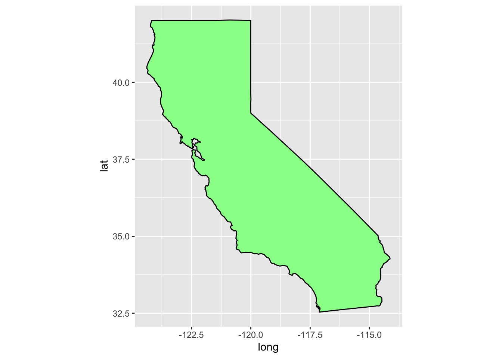
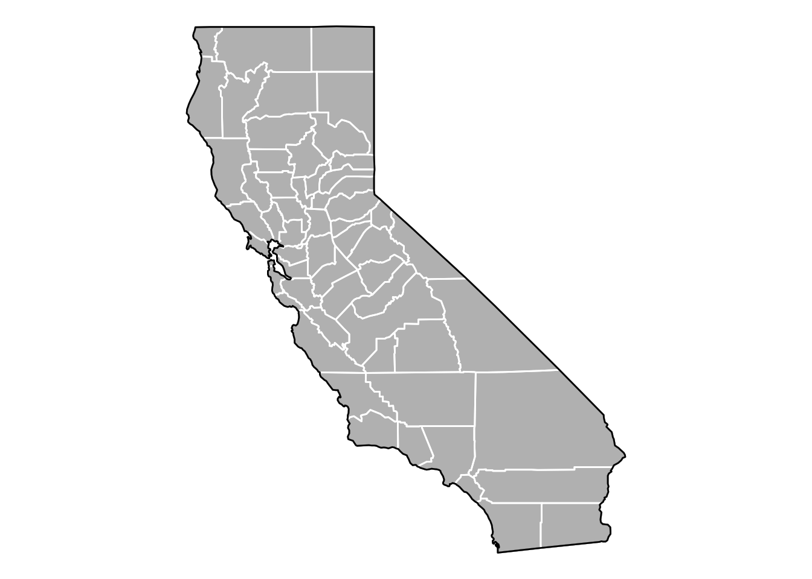

<!DOCTYPE html>
<html xmlns="http://www.w3.org/1999/xhtml" lang="en" xml:lang="en"><head>

<meta charset="utf-8">
<meta name="generator" content="quarto-1.1.189">

<meta name="viewport" content="width=device-width, initial-scale=1.0, user-scalable=yes">

<meta name="author" content="Karen Guerrero">

<title>Lab17</title>

<link href="Lab17_files/libs/quarto-html/tippy.css" rel="stylesheet">
<link href="Lab17_files/libs/quarto-html/quarto-syntax-highlighting.css" rel="stylesheet" id="quarto-text-highlighting-styles">

<link href="Lab17_files/libs/bootstrap/bootstrap-icons.css" rel="stylesheet">
<link href="Lab17_files/libs/bootstrap/bootstrap.min.css" rel="stylesheet" id="quarto-bootstrap" data-mode="light">

</head>

<body class="fullcontent">

<main class="content" id="quarto-document-content">

<header id="title-block-header" class="quarto-title-block default">

<h1 class="title">Lab17</h1>

    

    
Author

    

             
Karen Guerrero 

          

  

    
    
  

  

</header>

<pre class="sourceCode r code-with-copy"><code class="sourceCode r"># Import vaccination data
vax &lt;- read.csv("Statewide.csv")</code><button title="Copy to Clipboard" class="code-copy-button"><i class="bi"></i></button></pre>

#Q1. What column details the total number of people fully vaccinated? persons_fully_vaccinated

#Q2. What column details the Zip code tabulation area? zip_code_tabulation_area

#Q3. What is the earliest date in this dataset? 2021-01-05

#Q4. What is the latest date in this dataset? 2022-11-22

<pre class="sourceCode r code-with-copy"><code class="sourceCode r">head(vax)</code><button title="Copy to Clipboard" class="code-copy-button"><i class="bi"></i></button></pre>

<pre><code>  as_of_date zip_code_tabulation_area local_health_jurisdiction          county
1 2021-01-05                    92240                 Riverside       Riverside
2 2021-01-05                    91302               Los Angeles     Los Angeles
3 2021-01-05                    93420           San Luis Obispo San Luis Obispo
4 2021-01-05                    91901                 San Diego       San Diego
5 2021-01-05                    94110             San Francisco   San Francisco
6 2021-01-05                    91902                 San Diego       San Diego
  vaccine_equity_metric_quartile                 vem_source
1                              1 Healthy Places Index Score
2                              4 Healthy Places Index Score
3                              3 Healthy Places Index Score
4                              3 Healthy Places Index Score
5                              4 Healthy Places Index Score
6                              4 Healthy Places Index Score
  age12_plus_population age5_plus_population tot_population
1               29270.5                33093          35278
2               23163.9                25899          26712
3               26694.9                29253          30740
4               15549.8                16905          18162
5               64350.7                68320          72380
6               16620.7                18026          18896
  persons_fully_vaccinated persons_partially_vaccinated
1                       NA                           NA
2                       15                          614
3                       NA                           NA
4                       NA                           NA
5                       17                         1268
6                       15                          397
  percent_of_population_fully_vaccinated
1                                     NA
2                               0.000562
3                                     NA
4                                     NA
5                               0.000235
6                               0.000794
  percent_of_population_partially_vaccinated
1                                         NA
2                                   0.022986
3                                         NA
4                                         NA
5                                   0.017519
6                                   0.021010
  percent_of_population_with_1_plus_dose booster_recip_count
1                                     NA                  NA
2                               0.023548                  NA
3                                     NA                  NA
4                                     NA                  NA
5                               0.017754                  NA
6                               0.021804                  NA
  bivalent_dose_recip_count eligible_recipient_count
1                        NA                        2
2                        NA                       15
3                        NA                        4
4                        NA                        8
5                        NA                       17
6                        NA                       15
                                                               redacted
1 Information redacted in accordance with CA state privacy requirements
2 Information redacted in accordance with CA state privacy requirements
3 Information redacted in accordance with CA state privacy requirements
4 Information redacted in accordance with CA state privacy requirements
5 Information redacted in accordance with CA state privacy requirements
6 Information redacted in accordance with CA state privacy requirements</code></pre>

<pre class="sourceCode r code-with-copy"><code class="sourceCode r">tail(vax)</code><button title="Copy to Clipboard" class="code-copy-button"><i class="bi"></i></button></pre>

<pre><code>       as_of_date zip_code_tabulation_area local_health_jurisdiction
174631 2022-11-22                    94066                 San Mateo
174632 2022-11-22                    92254                 Riverside
174633 2022-11-22                    94065                 San Mateo
174634 2022-11-22                    92280            San Bernardino
174635 2022-11-22                    94929                     Marin
174636 2022-11-22                    92313            San Bernardino
               county vaccine_equity_metric_quartile                 vem_source
174631      San Mateo                              4 Healthy Places Index Score
174632      Riverside                              1 Healthy Places Index Score
174633      San Mateo                              4 Healthy Places Index Score
174634 San Bernardino                             NA            No VEM Assigned
174635          Marin                              4    CDPH-Derived ZCTA Score
174636 San Bernardino                              2 Healthy Places Index Score
       age12_plus_population age5_plus_population tot_population
174631               37730.3                40903          43101
174632                7882.3                 8985           9779
174633               10465.5                11778          12461
174634                   0.0                    0             NA
174635                 174.2                  218            254
174636               10842.9                11847          12547
       persons_fully_vaccinated persons_partially_vaccinated
174631                    38105                         2889
174632                     9456                         1688
174633                    11238                          889
174634                       NA                           NA
174635                       NA                           NA
174636                     7948                          600
       percent_of_population_fully_vaccinated
174631                               0.884086
174632                               0.966970
174633                               0.901854
174634                                     NA
174635                                     NA
174636                               0.633458
       percent_of_population_partially_vaccinated
174631                                   0.067029
174632                                   0.172615
174633                                   0.071343
174634                                         NA
174635                                         NA
174636                                   0.047820
       percent_of_population_with_1_plus_dose booster_recip_count
174631                               0.951115               27085
174632                               1.000000                3840
174633                               0.973197                8701
174634                                     NA                  NA
174635                                     NA                  NA
174636                               0.681278                4522
       bivalent_dose_recip_count eligible_recipient_count
174631                      9127                    37620
174632                       372                     9430
174633                      3456                    11021
174634                        NA                       14
174635                        NA                      159
174636                      1085                     7921
                                                                    redacted
174631                                                                    No
174632                                                                    No
174633                                                                    No
174634 Information redacted in accordance with CA state privacy requirements
174635 Information redacted in accordance with CA state privacy requirements
174636                                                                    No</code></pre>

#Q5. How many numeric columns are in this dataset? 13

<pre class="sourceCode r code-with-copy"><code class="sourceCode r">skimr::skim(vax)</code><button title="Copy to Clipboard" class="code-copy-button"><i class="bi"></i></button></pre>

<table class="table table-sm table-striped">
<caption>Data summary</caption>
<tbody>
<tr class="odd">
<td style="text-align: left;">Name</td>
<td style="text-align: left;">vax</td>
</tr>
<tr class="even">
<td style="text-align: left;">Number of rows</td>
<td style="text-align: left;">174636</td>
</tr>
<tr class="odd">
<td style="text-align: left;">Number of columns</td>
<td style="text-align: left;">18</td>
</tr>
<tr class="even">
<td style="text-align: left;">_______________________</td>
<td style="text-align: left;"></td>
</tr>
<tr class="odd">
<td style="text-align: left;">Column type frequency:</td>
<td style="text-align: left;"></td>
</tr>
<tr class="even">
<td style="text-align: left;">character</td>
<td style="text-align: left;">5</td>
</tr>
<tr class="odd">
<td style="text-align: left;">numeric</td>
<td style="text-align: left;">13</td>
</tr>
<tr class="even">
<td style="text-align: left;">________________________</td>
<td style="text-align: left;"></td>
</tr>
<tr class="odd">
<td style="text-align: left;">Group variables</td>
<td style="text-align: left;">None</td>
</tr>
</tbody>
</table>

<strong>Variable type: character</strong>

<table class="table table-sm table-striped">
<colgroup>
<col style="width: 30%">
<col style="width: 11%">
<col style="width: 16%">
<col style="width: 4%">
<col style="width: 4%">
<col style="width: 7%">
<col style="width: 10%">
<col style="width: 13%">
</colgroup>
<thead>
<tr class="header">
<th style="text-align: left;">skim_variable</th>
<th style="text-align: right;">n_missing</th>
<th style="text-align: right;">complete_rate</th>
<th style="text-align: right;">min</th>
<th style="text-align: right;">max</th>
<th style="text-align: right;">empty</th>
<th style="text-align: right;">n_unique</th>
<th style="text-align: right;">whitespace</th>
</tr>
</thead>
<tbody>
<tr class="odd">
<td style="text-align: left;">as_of_date</td>
<td style="text-align: right;">0</td>
<td style="text-align: right;">1</td>
<td style="text-align: right;">10</td>
<td style="text-align: right;">10</td>
<td style="text-align: right;">0</td>
<td style="text-align: right;">99</td>
<td style="text-align: right;">0</td>
</tr>
<tr class="even">
<td style="text-align: left;">local_health_jurisdiction</td>
<td style="text-align: right;">0</td>
<td style="text-align: right;">1</td>
<td style="text-align: right;">0</td>
<td style="text-align: right;">15</td>
<td style="text-align: right;">495</td>
<td style="text-align: right;">62</td>
<td style="text-align: right;">0</td>
</tr>
<tr class="odd">
<td style="text-align: left;">county</td>
<td style="text-align: right;">0</td>
<td style="text-align: right;">1</td>
<td style="text-align: right;">0</td>
<td style="text-align: right;">15</td>
<td style="text-align: right;">495</td>
<td style="text-align: right;">59</td>
<td style="text-align: right;">0</td>
</tr>
<tr class="even">
<td style="text-align: left;">vem_source</td>
<td style="text-align: right;">0</td>
<td style="text-align: right;">1</td>
<td style="text-align: right;">15</td>
<td style="text-align: right;">26</td>
<td style="text-align: right;">0</td>
<td style="text-align: right;">3</td>
<td style="text-align: right;">0</td>
</tr>
<tr class="odd">
<td style="text-align: left;">redacted</td>
<td style="text-align: right;">0</td>
<td style="text-align: right;">1</td>
<td style="text-align: right;">2</td>
<td style="text-align: right;">69</td>
<td style="text-align: right;">0</td>
<td style="text-align: right;">2</td>
<td style="text-align: right;">0</td>
</tr>
</tbody>
</table>

<strong>Variable type: numeric</strong>

<table class="table table-sm table-striped">
<colgroup>
<col style="width: 32%">
<col style="width: 7%">
<col style="width: 10%">
<col style="width: 6%">
<col style="width: 6%">
<col style="width: 4%">
<col style="width: 6%">
<col style="width: 6%">
<col style="width: 6%">
<col style="width: 6%">
<col style="width: 4%">
</colgroup>
<thead>
<tr class="header">
<th style="text-align: left;">skim_variable</th>
<th style="text-align: right;">n_missing</th>
<th style="text-align: right;">complete_rate</th>
<th style="text-align: right;">mean</th>
<th style="text-align: right;">sd</th>
<th style="text-align: right;">p0</th>
<th style="text-align: right;">p25</th>
<th style="text-align: right;">p50</th>
<th style="text-align: right;">p75</th>
<th style="text-align: right;">p100</th>
<th style="text-align: left;">hist</th>
</tr>
</thead>
<tbody>
<tr class="odd">
<td style="text-align: left;">zip_code_tabulation_area</td>
<td style="text-align: right;">0</td>
<td style="text-align: right;">1.00</td>
<td style="text-align: right;">93665.11</td>
<td style="text-align: right;">1817.39</td>
<td style="text-align: right;">90001</td>
<td style="text-align: right;">92257.75</td>
<td style="text-align: right;">93658.50</td>
<td style="text-align: right;">95380.50</td>
<td style="text-align: right;">97635.0</td>
<td style="text-align: left;">▃▅▅▇▁</td>
</tr>
<tr class="even">
<td style="text-align: left;">vaccine_equity_metric_quartile</td>
<td style="text-align: right;">8613</td>
<td style="text-align: right;">0.95</td>
<td style="text-align: right;">2.44</td>
<td style="text-align: right;">1.11</td>
<td style="text-align: right;">1</td>
<td style="text-align: right;">1.00</td>
<td style="text-align: right;">2.00</td>
<td style="text-align: right;">3.00</td>
<td style="text-align: right;">4.0</td>
<td style="text-align: left;">▇▇▁▇▇</td>
</tr>
<tr class="odd">
<td style="text-align: left;">age12_plus_population</td>
<td style="text-align: right;">0</td>
<td style="text-align: right;">1.00</td>
<td style="text-align: right;">18895.04</td>
<td style="text-align: right;">18993.88</td>
<td style="text-align: right;">0</td>
<td style="text-align: right;">1346.95</td>
<td style="text-align: right;">13685.10</td>
<td style="text-align: right;">31756.12</td>
<td style="text-align: right;">88556.7</td>
<td style="text-align: left;">▇▃▂▁▁</td>
</tr>
<tr class="even">
<td style="text-align: left;">age5_plus_population</td>
<td style="text-align: right;">0</td>
<td style="text-align: right;">1.00</td>
<td style="text-align: right;">20875.24</td>
<td style="text-align: right;">21105.98</td>
<td style="text-align: right;">0</td>
<td style="text-align: right;">1460.50</td>
<td style="text-align: right;">15364.00</td>
<td style="text-align: right;">34877.00</td>
<td style="text-align: right;">101902.0</td>
<td style="text-align: left;">▇▃▂▁▁</td>
</tr>
<tr class="odd">
<td style="text-align: left;">tot_population</td>
<td style="text-align: right;">8514</td>
<td style="text-align: right;">0.95</td>
<td style="text-align: right;">23372.77</td>
<td style="text-align: right;">22628.51</td>
<td style="text-align: right;">12</td>
<td style="text-align: right;">2126.00</td>
<td style="text-align: right;">18714.00</td>
<td style="text-align: right;">38168.00</td>
<td style="text-align: right;">111165.0</td>
<td style="text-align: left;">▇▅▂▁▁</td>
</tr>
<tr class="even">
<td style="text-align: left;">persons_fully_vaccinated</td>
<td style="text-align: right;">14921</td>
<td style="text-align: right;">0.91</td>
<td style="text-align: right;">13466.34</td>
<td style="text-align: right;">14722.46</td>
<td style="text-align: right;">11</td>
<td style="text-align: right;">883.00</td>
<td style="text-align: right;">8024.00</td>
<td style="text-align: right;">22529.00</td>
<td style="text-align: right;">87186.0</td>
<td style="text-align: left;">▇▃▁▁▁</td>
</tr>
<tr class="odd">
<td style="text-align: left;">persons_partially_vaccinated</td>
<td style="text-align: right;">14921</td>
<td style="text-align: right;">0.91</td>
<td style="text-align: right;">1707.50</td>
<td style="text-align: right;">1998.80</td>
<td style="text-align: right;">11</td>
<td style="text-align: right;">167.00</td>
<td style="text-align: right;">1194.00</td>
<td style="text-align: right;">2547.00</td>
<td style="text-align: right;">39204.0</td>
<td style="text-align: left;">▇▁▁▁▁</td>
</tr>
<tr class="even">
<td style="text-align: left;">percent_of_population_fully_vaccinated</td>
<td style="text-align: right;">18665</td>
<td style="text-align: right;">0.89</td>
<td style="text-align: right;">0.55</td>
<td style="text-align: right;">0.25</td>
<td style="text-align: right;">0</td>
<td style="text-align: right;">0.39</td>
<td style="text-align: right;">0.59</td>
<td style="text-align: right;">0.73</td>
<td style="text-align: right;">1.0</td>
<td style="text-align: left;">▃▃▆▇▃</td>
</tr>
<tr class="odd">
<td style="text-align: left;">percent_of_population_partially_vaccinated</td>
<td style="text-align: right;">18665</td>
<td style="text-align: right;">0.89</td>
<td style="text-align: right;">0.08</td>
<td style="text-align: right;">0.09</td>
<td style="text-align: right;">0</td>
<td style="text-align: right;">0.05</td>
<td style="text-align: right;">0.06</td>
<td style="text-align: right;">0.08</td>
<td style="text-align: right;">1.0</td>
<td style="text-align: left;">▇▁▁▁▁</td>
</tr>
<tr class="even">
<td style="text-align: left;">percent_of_population_with_1_plus_dose</td>
<td style="text-align: right;">19562</td>
<td style="text-align: right;">0.89</td>
<td style="text-align: right;">0.61</td>
<td style="text-align: right;">0.25</td>
<td style="text-align: right;">0</td>
<td style="text-align: right;">0.46</td>
<td style="text-align: right;">0.65</td>
<td style="text-align: right;">0.79</td>
<td style="text-align: right;">1.0</td>
<td style="text-align: left;">▂▂▆▇▆</td>
</tr>
<tr class="odd">
<td style="text-align: left;">booster_recip_count</td>
<td style="text-align: right;">70421</td>
<td style="text-align: right;">0.60</td>
<td style="text-align: right;">5655.17</td>
<td style="text-align: right;">6867.49</td>
<td style="text-align: right;">11</td>
<td style="text-align: right;">280.00</td>
<td style="text-align: right;">2575.00</td>
<td style="text-align: right;">9421.00</td>
<td style="text-align: right;">58304.0</td>
<td style="text-align: left;">▇▂▁▁▁</td>
</tr>
<tr class="even">
<td style="text-align: left;">bivalent_dose_recip_count</td>
<td style="text-align: right;">156958</td>
<td style="text-align: right;">0.10</td>
<td style="text-align: right;">1646.02</td>
<td style="text-align: right;">2161.84</td>
<td style="text-align: right;">11</td>
<td style="text-align: right;">109.00</td>
<td style="text-align: right;">719.00</td>
<td style="text-align: right;">2443.00</td>
<td style="text-align: right;">18109.0</td>
<td style="text-align: left;">▇▁▁▁▁</td>
</tr>
<tr class="odd">
<td style="text-align: left;">eligible_recipient_count</td>
<td style="text-align: right;">0</td>
<td style="text-align: right;">1.00</td>
<td style="text-align: right;">12309.19</td>
<td style="text-align: right;">14555.83</td>
<td style="text-align: right;">0</td>
<td style="text-align: right;">466.00</td>
<td style="text-align: right;">5810.00</td>
<td style="text-align: right;">21140.00</td>
<td style="text-align: right;">86696.0</td>
<td style="text-align: left;">▇▂▁▁▁</td>
</tr>
</tbody>
</table>

<pre class="sourceCode r code-with-copy"><code class="sourceCode r">sum(is.na(vax$persons_fully_vaccinated))</code><button title="Copy to Clipboard" class="code-copy-button"><i class="bi"></i></button></pre>

<pre><code>[1] 14921</code></pre>

<pre class="sourceCode r code-with-copy"><code class="sourceCode r">library(lubridate)</code><button title="Copy to Clipboard" class="code-copy-button"><i class="bi"></i></button></pre>

<pre><code>Loading required package: timechange</code></pre>

<pre><code>
Attaching package: 'lubridate'</code></pre>

<pre><code>The following objects are masked from 'package:base':

    date, intersect, setdiff, union</code></pre>

<pre class="sourceCode r code-with-copy"><code class="sourceCode r">today()</code><button title="Copy to Clipboard" class="code-copy-button"><i class="bi"></i></button></pre>

<pre><code>[1] "2022-12-02"</code></pre>

<pre class="sourceCode r code-with-copy"><code class="sourceCode r"># This will give an Error!
##today() - vax$as_of_date[1]</code><button title="Copy to Clipboard" class="code-copy-button"><i class="bi"></i></button></pre>

<pre class="sourceCode r code-with-copy"><code class="sourceCode r"># Specify that we are using the year-month-day format
vax$as_of_date &lt;- ymd(vax$as_of_date)</code><button title="Copy to Clipboard" class="code-copy-button"><i class="bi"></i></button></pre>

<pre class="sourceCode r code-with-copy"><code class="sourceCode r">today() - vax$as_of_date[1]</code><button title="Copy to Clipboard" class="code-copy-button"><i class="bi"></i></button></pre>

<pre><code>Time difference of 696 days</code></pre>

<pre class="sourceCode r code-with-copy"><code class="sourceCode r">vax$as_of_date[nrow(vax)] - vax$as_of_date[1]</code><button title="Copy to Clipboard" class="code-copy-button"><i class="bi"></i></button></pre>

<pre><code>Time difference of 686 days</code></pre>

<pre class="sourceCode r code-with-copy"><code class="sourceCode r">library(zipcodeR)</code><button title="Copy to Clipboard" class="code-copy-button"><i class="bi"></i></button></pre>

<pre class="sourceCode r code-with-copy"><code class="sourceCode r">geocode_zip('92037')</code><button title="Copy to Clipboard" class="code-copy-button"><i class="bi"></i></button></pre>

<pre><code># A tibble: 1 × 3
  zipcode   lat   lng
  &lt;chr&gt;   &lt;dbl&gt; &lt;dbl&gt;
1 92037    32.8 -117.</code></pre>

<pre class="sourceCode r code-with-copy"><code class="sourceCode r">zip_distance('92037','92109')</code><button title="Copy to Clipboard" class="code-copy-button"><i class="bi"></i></button></pre>

<pre><code>  zipcode_a zipcode_b distance
1     92037     92109     2.33</code></pre>

<pre class="sourceCode r code-with-copy"><code class="sourceCode r">reverse_zipcode(c('92037', "92109") )</code><button title="Copy to Clipboard" class="code-copy-button"><i class="bi"></i></button></pre>

<pre><code># A tibble: 2 × 24
  zipcode zipcode_…¹ major…² post_…³ common_c…⁴ county state   lat   lng timez…⁵
  &lt;chr&gt;   &lt;chr&gt;      &lt;chr&gt;   &lt;chr&gt;       &lt;blob&gt; &lt;chr&gt;  &lt;chr&gt; &lt;dbl&gt; &lt;dbl&gt; &lt;chr&gt;  
1 92037   Standard   La Jol… La Jol… &lt;raw 20 B&gt; San D… CA     32.8 -117. Pacific
2 92109   Standard   San Di… San Di… &lt;raw 21 B&gt; San D… CA     32.8 -117. Pacific
# … with 14 more variables: radius_in_miles &lt;dbl&gt;, area_code_list &lt;blob&gt;,
#   population &lt;int&gt;, population_density &lt;dbl&gt;, land_area_in_sqmi &lt;dbl&gt;,
#   water_area_in_sqmi &lt;dbl&gt;, housing_units &lt;int&gt;,
#   occupied_housing_units &lt;int&gt;, median_home_value &lt;int&gt;,
#   median_household_income &lt;int&gt;, bounds_west &lt;dbl&gt;, bounds_east &lt;dbl&gt;,
#   bounds_north &lt;dbl&gt;, bounds_south &lt;dbl&gt;, and abbreviated variable names
#   ¹​zipcode_type, ²​major_city, ³​post_office_city, ⁴​common_city_list, …</code></pre>

<pre class="sourceCode r code-with-copy"><code class="sourceCode r"># Pull data for all ZIP codes in the dataset
zipdata &lt;- reverse_zipcode( vax$zip_code_tabulation_area )</code><button title="Copy to Clipboard" class="code-copy-button"><i class="bi"></i></button></pre>

<pre class="sourceCode r code-with-copy"><code class="sourceCode r">#vax$county == "San Diego"</code><button title="Copy to Clipboard" class="code-copy-button"><i class="bi"></i></button></pre>

<pre class="sourceCode r code-with-copy"><code class="sourceCode r">library(ggplot2)
library(ggmap)</code><button title="Copy to Clipboard" class="code-copy-button"><i class="bi"></i></button></pre>

<pre><code>ℹ Google's Terms of Service: &lt;]8;;https://mapsplatform.google.comhttps://mapsplatform.google.com]8;;&gt;</code></pre>

<pre><code>ℹ Please cite ggmap if you use it! Use `citation("ggmap")` for details.</code></pre>

<pre class="sourceCode r code-with-copy"><code class="sourceCode r">library(maps)
library(mapdata)</code><button title="Copy to Clipboard" class="code-copy-button"><i class="bi"></i></button></pre>

<pre class="sourceCode r code-with-copy"><code class="sourceCode r">usa &lt;- map_data("usa")</code><button title="Copy to Clipboard" class="code-copy-button"><i class="bi"></i></button></pre>

<pre class="sourceCode r code-with-copy"><code class="sourceCode r">dim(usa)</code><button title="Copy to Clipboard" class="code-copy-button"><i class="bi"></i></button></pre>

<pre><code>[1] 7243    6</code></pre>

<pre class="sourceCode r code-with-copy"><code class="sourceCode r">head(usa)</code><button title="Copy to Clipboard" class="code-copy-button"><i class="bi"></i></button></pre>

<pre><code>       long      lat group order region subregion
1 -101.4078 29.74224     1     1   main      &lt;NA&gt;
2 -101.3906 29.74224     1     2   main      &lt;NA&gt;
3 -101.3620 29.65056     1     3   main      &lt;NA&gt;
4 -101.3505 29.63911     1     4   main      &lt;NA&gt;
5 -101.3219 29.63338     1     5   main      &lt;NA&gt;
6 -101.3047 29.64484     1     6   main      &lt;NA&gt;</code></pre>

<pre class="sourceCode r code-with-copy"><code class="sourceCode r">tail(usa)</code><button title="Copy to Clipboard" class="code-copy-button"><i class="bi"></i></button></pre>

<pre><code>          long      lat group order         region subregion
7247 -122.6187 48.37482    10  7247 whidbey island      &lt;NA&gt;
7248 -122.6359 48.35764    10  7248 whidbey island      &lt;NA&gt;
7249 -122.6703 48.31180    10  7249 whidbey island      &lt;NA&gt;
7250 -122.7218 48.23732    10  7250 whidbey island      &lt;NA&gt;
7251 -122.7104 48.21440    10  7251 whidbey island      &lt;NA&gt;
7252 -122.6703 48.17429    10  7252 whidbey island      &lt;NA&gt;</code></pre>

<pre class="sourceCode r code-with-copy"><code class="sourceCode r">states &lt;- map_data("state")
cali &lt;- subset(states, region %in% c("california"))</code><button title="Copy to Clipboard" class="code-copy-button"><i class="bi"></i></button></pre>

<pre class="sourceCode r code-with-copy"><code class="sourceCode r">ggplot(data = cali) + 
  geom_polygon(aes(x = long, y = lat, group = group), fill = "palegreen", color = "black") + 
  coord_fixed(1.3)</code><button title="Copy to Clipboard" class="code-copy-button"><i class="bi"></i></button></pre>

<pre class="sourceCode r code-with-copy"><code class="sourceCode r">ca_df &lt;- subset(states, region == "california")</code><button title="Copy to Clipboard" class="code-copy-button"><i class="bi"></i></button></pre>

<pre class="sourceCode r code-with-copy"><code class="sourceCode r">counties &lt;- map_data("county")</code><button title="Copy to Clipboard" class="code-copy-button"><i class="bi"></i></button></pre>

<pre class="sourceCode r code-with-copy"><code class="sourceCode r">ca_county &lt;- subset(counties, region == "california")</code><button title="Copy to Clipboard" class="code-copy-button"><i class="bi"></i></button></pre>

<pre class="sourceCode r code-with-copy"><code class="sourceCode r">ca_base &lt;- ggplot(data = ca_df, mapping = aes(x = long, y = lat, group = group)) + 
  coord_fixed(1.3) + 
  geom_polygon(color = "black", fill = "gray")
ca_base + theme_nothing()</code><button title="Copy to Clipboard" class="code-copy-button"><i class="bi"></i></button></pre>

<pre class="sourceCode r code-with-copy"><code class="sourceCode r">ca_base + theme_nothing() + 
  geom_polygon(data = ca_county, fill = NA, color = "white") +
  geom_polygon(color = "black", fill = NA)  # get the state border back on top</code><button title="Copy to Clipboard" class="code-copy-button"><i class="bi"></i></button></pre>

<pre class="sourceCode r code-with-copy"><code class="sourceCode r">library(stringr)</code><button title="Copy to Clipboard" class="code-copy-button"><i class="bi"></i></button></pre>

<pre class="sourceCode r code-with-copy"><code class="sourceCode r"># make a data frame
    x &lt;- readLines("population.txt")</code><button title="Copy to Clipboard" class="code-copy-button"><i class="bi"></i></button></pre>

<pre><code>Warning in readLines("population.txt"): incomplete final line found on
'population.txt'</code></pre>

<pre class="sourceCode r code-with-copy"><code class="sourceCode r">    pop_and_area &lt;- str_match(x, "^([a-zA-Z ]+)County\t.*\t([0-9,]{2,10})\t([0-9,]{2,10}) sq mi$")[, -1] %&gt;%
      na.omit() %&gt;%
      str_replace_all(",", "") %&gt;% 
      str_trim() %&gt;%
      tolower() %&gt;%
      as.data.frame(stringsAsFactors = FALSE)</code><button title="Copy to Clipboard" class="code-copy-button"><i class="bi"></i></button></pre>

<pre class="sourceCode r code-with-copy"><code class="sourceCode r">View(x)</code><button title="Copy to Clipboard" class="code-copy-button"><i class="bi"></i></button></pre>

<pre class="sourceCode r code-with-copy"><code class="sourceCode r">    # give names and make population and area numeric
    #names(pop_and_area) &lt;- c("subregion", "population", "area")
    #pop_and_area$population &lt;- as.numeric(pop_and_area$population)
    #pop_and_area$area &lt;- as.numeric(pop_and_area$area)</code><button title="Copy to Clipboard" class="code-copy-button"><i class="bi"></i></button></pre>

<pre class="sourceCode r code-with-copy"><code class="sourceCode r">library(dplyr)</code><button title="Copy to Clipboard" class="code-copy-button"><i class="bi"></i></button></pre>

<pre><code>
Attaching package: 'dplyr'</code></pre>

<pre><code>The following objects are masked from 'package:stats':

    filter, lag</code></pre>

<pre><code>The following objects are masked from 'package:base':

    intersect, setdiff, setequal, union</code></pre>

<pre class="sourceCode r code-with-copy"><code class="sourceCode r">sd &lt;- filter(vax, county == "San Diego")</code><button title="Copy to Clipboard" class="code-copy-button"><i class="bi"></i></button></pre>

<pre class="sourceCode r code-with-copy"><code class="sourceCode r">nrow(sd)</code><button title="Copy to Clipboard" class="code-copy-button"><i class="bi"></i></button></pre>

<pre><code>[1] 10593</code></pre>

<pre class="sourceCode r code-with-copy"><code class="sourceCode r">sd.10 &lt;- filter(vax, county == "San Diego" &amp;
                age5_plus_population &gt; 10000)</code><button title="Copy to Clipboard" class="code-copy-button"><i class="bi"></i></button></pre>

<pre class="sourceCode r code-with-copy"><code class="sourceCode r">unique(sd.10$zip_code_tabulation_area)</code><button title="Copy to Clipboard" class="code-copy-button"><i class="bi"></i></button></pre>

<pre><code> [1] 91901 91902 92081 92130 92126 92069 92064 91945 91941 91911 92010 92019
[13] 92011 92055 92058 92123 92139 92173 92117 92078 91913 91942 91914 91932
[25] 91950 92131 92102 91910 92115 92120 92122 92154 92114 92009 92014 92029
[37] 92057 92082 92124 92026 92104 92084 92083 92075 92118 92116 92113 92103
[49] 92056 92054 92040 91977 91915 92105 92107 92021 92024 92028 92065 92008
[61] 92007 92037 92020 92025 92027 92128 92106 92108 92109 92119 92127 92129
[73] 92101 92071 92110 92111</code></pre>

<pre class="sourceCode r code-with-copy"><code class="sourceCode r">sd.10[!duplicated(sd.10$zip_code_tabulation_area), ]</code><button title="Copy to Clipboard" class="code-copy-button"><i class="bi"></i></button></pre>

<pre><code>   as_of_date zip_code_tabulation_area local_health_jurisdiction    county
1  2021-01-05                    91901                 San Diego San Diego
2  2021-01-05                    91902                 San Diego San Diego
3  2021-01-05                    92081                 San Diego San Diego
4  2021-01-05                    92130                 San Diego San Diego
5  2021-01-05                    92126                 San Diego San Diego
6  2021-01-05                    92069                 San Diego San Diego
7  2021-01-05                    92064                 San Diego San Diego
8  2021-01-05                    91945                 San Diego San Diego
9  2021-01-05                    91941                 San Diego San Diego
10 2021-01-05                    91911                 San Diego San Diego
11 2021-01-05                    92010                 San Diego San Diego
12 2021-01-05                    92019                 San Diego San Diego
13 2021-01-05                    92011                 San Diego San Diego
14 2021-01-05                    92055                 San Diego San Diego
15 2021-01-05                    92058                 San Diego San Diego
16 2021-01-05                    92123                 San Diego San Diego
17 2021-01-05                    92139                 San Diego San Diego
18 2021-01-05                    92173                 San Diego San Diego
19 2021-01-05                    92117                 San Diego San Diego
20 2021-01-05                    92078                 San Diego San Diego
21 2021-01-05                    91913                 San Diego San Diego
22 2021-01-05                    91942                 San Diego San Diego
23 2021-01-05                    91914                 San Diego San Diego
24 2021-01-05                    91932                 San Diego San Diego
25 2021-01-05                    91950                 San Diego San Diego
26 2021-01-05                    92131                 San Diego San Diego
27 2021-01-05                    92102                 San Diego San Diego
28 2021-01-05                    91910                 San Diego San Diego
29 2021-01-05                    92115                 San Diego San Diego
30 2021-01-05                    92120                 San Diego San Diego
31 2021-01-05                    92122                 San Diego San Diego
32 2021-01-05                    92154                 San Diego San Diego
33 2021-01-05                    92114                 San Diego San Diego
34 2021-01-05                    92009                 San Diego San Diego
35 2021-01-05                    92014                 San Diego San Diego
36 2021-01-05                    92029                 San Diego San Diego
37 2021-01-05                    92057                 San Diego San Diego
38 2021-01-05                    92082                 San Diego San Diego
39 2021-01-05                    92124                 San Diego San Diego
40 2021-01-05                    92026                 San Diego San Diego
41 2021-01-05                    92104                 San Diego San Diego
42 2021-01-05                    92084                 San Diego San Diego
43 2021-01-05                    92083                 San Diego San Diego
44 2021-01-05                    92075                 San Diego San Diego
45 2021-01-05                    92118                 San Diego San Diego
46 2021-01-05                    92116                 San Diego San Diego
47 2021-01-05                    92113                 San Diego San Diego
48 2021-01-05                    92103                 San Diego San Diego
49 2021-01-05                    92056                 San Diego San Diego
50 2021-01-05                    92054                 San Diego San Diego
51 2021-01-05                    92040                 San Diego San Diego
52 2021-01-05                    91977                 San Diego San Diego
53 2021-01-05                    91915                 San Diego San Diego
54 2021-01-05                    92105                 San Diego San Diego
55 2021-01-05                    92107                 San Diego San Diego
56 2021-01-05                    92021                 San Diego San Diego
57 2021-01-05                    92024                 San Diego San Diego
58 2021-01-05                    92028                 San Diego San Diego
59 2021-01-05                    92065                 San Diego San Diego
60 2021-01-05                    92008                 San Diego San Diego
61 2021-01-05                    92007                 San Diego San Diego
62 2021-01-05                    92037                 San Diego San Diego
63 2021-01-05                    92020                 San Diego San Diego
64 2021-01-05                    92025                 San Diego San Diego
65 2021-01-05                    92027                 San Diego San Diego
66 2021-01-05                    92128                 San Diego San Diego
67 2021-01-05                    92106                 San Diego San Diego
68 2021-01-05                    92108                 San Diego San Diego
69 2021-01-05                    92109                 San Diego San Diego
70 2021-01-05                    92119                 San Diego San Diego
71 2021-01-05                    92127                 San Diego San Diego
72 2021-01-05                    92129                 San Diego San Diego
73 2021-01-05                    92101                 San Diego San Diego
74 2021-01-05                    92071                 San Diego San Diego
75 2021-01-05                    92110                 San Diego San Diego
76 2021-01-05                    92111                 San Diego San Diego
   vaccine_equity_metric_quartile                 vem_source
1                               3 Healthy Places Index Score
2                               4 Healthy Places Index Score
3                               2 Healthy Places Index Score
4                               4 Healthy Places Index Score
5                               4 Healthy Places Index Score
6                               2 Healthy Places Index Score
7                               4 Healthy Places Index Score
8                               2 Healthy Places Index Score
9                               3 Healthy Places Index Score
10                              2 Healthy Places Index Score
11                              4 Healthy Places Index Score
12                              3 Healthy Places Index Score
13                              4 Healthy Places Index Score
14                              3    CDPH-Derived ZCTA Score
15                              1 Healthy Places Index Score
16                              3 Healthy Places Index Score
17                              2 Healthy Places Index Score
18                              1 Healthy Places Index Score
19                              3 Healthy Places Index Score
20                              3 Healthy Places Index Score
21                              3 Healthy Places Index Score
22                              3 Healthy Places Index Score
23                              4 Healthy Places Index Score
24                              2 Healthy Places Index Score
25                              1 Healthy Places Index Score
26                              4 Healthy Places Index Score
27                              1 Healthy Places Index Score
28                              2 Healthy Places Index Score
29                              2 Healthy Places Index Score
30                              4 Healthy Places Index Score
31                              4 Healthy Places Index Score
32                              2 Healthy Places Index Score
33                              2 Healthy Places Index Score
34                              4 Healthy Places Index Score
35                              4 Healthy Places Index Score
36                              3 Healthy Places Index Score
37                              2 Healthy Places Index Score
38                              3 Healthy Places Index Score
39                              3 Healthy Places Index Score
40                              2 Healthy Places Index Score
41                              3 Healthy Places Index Score
42                              2 Healthy Places Index Score
43                              2 Healthy Places Index Score
44                              4 Healthy Places Index Score
45                              3 Healthy Places Index Score
46                              3 Healthy Places Index Score
47                              1 Healthy Places Index Score
48                              4 Healthy Places Index Score
49                              3 Healthy Places Index Score
50                              2 Healthy Places Index Score
51                              3 Healthy Places Index Score
52                              2 Healthy Places Index Score
53                              4 Healthy Places Index Score
54                              1 Healthy Places Index Score
55                              3 Healthy Places Index Score
56                              2 Healthy Places Index Score
57                              4 Healthy Places Index Score
58                              2 Healthy Places Index Score
59                              3 Healthy Places Index Score
60                              3 Healthy Places Index Score
61                              4 Healthy Places Index Score
62                              4 Healthy Places Index Score
63                              2 Healthy Places Index Score
64                              2 Healthy Places Index Score
65                              2 Healthy Places Index Score
66                              4 Healthy Places Index Score
67                              4 Healthy Places Index Score
68                              3 Healthy Places Index Score
69                              3 Healthy Places Index Score
70                              4 Healthy Places Index Score
71                              4 Healthy Places Index Score
72                              4 Healthy Places Index Score
73                              2 Healthy Places Index Score
74                              3 Healthy Places Index Score
75                              3 Healthy Places Index Score
76                              3 Healthy Places Index Score
   age12_plus_population age5_plus_population tot_population
1                15549.8                16905          18162
2                16620.7                18026          18896
3                25558.0                27632          29596
4                46300.3                53102          56134
5                71820.2                77775          82658
6                41447.3                46850          50376
7                42177.1                46855          49805
8                22820.5                25486          27236
9                27354.6                29757          31918
10               71642.8                79225          84026
11               13762.3                14939          16346
12               37439.4                40464          43272
13               20503.6                23247          24144
14               11548.0                11654          11765
15               34956.0                39695          46029
16               28353.3                30426          32473
17               30679.9                33923          36105
18               25332.5                28487          31000
19               50041.6                53839          56983
20               41789.5                47476          50510
21               43514.7                50461          54114
22               34685.9                37483          40151
23               14156.9                16302          17379
24               21968.2                24874          26492
25               54341.2                59361          62859
26               28789.5                32291          34727
27               37042.3                41033          44010
28               64013.6                70086          74855
29               56152.4                60409          64343
30               26372.9                28414          30550
31               44091.1                45951          48071
32               76365.2                82971          88979
33               59050.7                64945          68851
34               39183.5                43710          46612
35               11942.5                13149          13568
36               16904.2                18441          19382
37               51927.0                56906          60414
38               16113.9                17551          18705
39               25422.4                29040          32600
40               42613.9                46283          50321
41               40343.9                42839          45435
42               42677.7                47784          51619
43               32246.5                36283          39509
44               11136.3                12177          12752
45               19835.0                21470          22548
46               30255.7                31673          33408
47               47799.7                53883          58408
48               32146.4                33213          34700
49               45552.2                49110          52337
50               35176.1                39270          41807
51               39405.0                42833          46306
52               53851.0                59911          64750
53               26688.6                30884          33485
54               61097.9                68711          73623
55               28321.0                29863          31223
56               59134.5                65415          70148
57               44405.4                48477          51381
58               41252.1                44782          48173
59               32025.6                35208          37505
60               24104.7                25958          27151
61               10061.5                10704          11417
62               33675.6                36144          38168
63               49284.5                54991          59743
64               43598.3                49162          52985
65               47422.5                52758          56788
66               44465.5                48329          51357
67               17253.3                19025          20155
68               20384.0                21182          22280
69               43222.5                44953          47111
70               21444.8                23472          24831
71               38942.3                46080          49935
72               46449.1                51493          54762
73               39588.5                40077          41159
74               49137.8                53795          57710
75               27003.5                28597          30108
76               44075.0                48160          50693
   persons_fully_vaccinated persons_partially_vaccinated
1                        NA                           NA
2                        15                          397
3                        14                          360
4                        46                         1919
5                        33                         1846
6                        21                          623
7                        40                         1019
8                        NA                           NA
9                        20                          780
10                       30                         1413
11                       NA                           NA
12                       13                          666
13                       NA                           NA
14                       NA                           NA
15                       NA                           NA
16                      404                         3509
17                       16                          839
18                       NA                           NA
19                       27                         1142
20                       29                          723
21                       24                         2010
22                       21                          988
23                       NA                           NA
24                       NA                           NA
25                       36                          913
26                       33                         1081
27                       20                         1294
28                       24                         1383
29                       23                          877
30                       25                          898
31                       20                         1252
32                       17                         1379
33                       13                         1206
34                       23                          890
35                       18                          435
36                       NA                           NA
37                       13                          717
38                       NA                           NA
39                       20                          585
40                       33                          765
41                       40                         1143
42                       11                          459
43                       11                          456
44                       NA                           NA
45                       NA                           NA
46                       28                          905
47                       11                          377
48                       37                         1383
49                       14                          803
50                       14                          424
51                       14                          582
52                       14                          929
53                       18                          995
54                       NA                           NA
55                       18                          704
56                       17                          902
57                       20                         1112
58                       15                          492
59                       NA                           NA
60                       NA                           NA
61                       NA                           NA
62                       29                         1336
63                       15                          920
64                       19                          646
65                       22                          670
66                       22                         1156
67                       NA                           NA
68                       18                          839
69                       23                         1185
70                       NA                           NA
71                       46                         1116
72                       35                         1307
73                       41                          991
74                       20                         1384
75                       17                          535
76                       23                          938
   percent_of_population_fully_vaccinated
1                                      NA
2                                0.000794
3                                0.000473
4                                0.000819
5                                0.000399
6                                0.000417
7                                0.000803
8                                      NA
9                                0.000627
10                               0.000357
11                                     NA
12                               0.000300
13                                     NA
14                                     NA
15                                     NA
16                               0.012441
17                               0.000443
18                                     NA
19                               0.000474
20                               0.000574
21                               0.000444
22                               0.000523
23                                     NA
24                                     NA
25                               0.000573
26                               0.000950
27                               0.000454
28                               0.000321
29                               0.000357
30                               0.000818
31                               0.000416
32                               0.000191
33                               0.000189
34                               0.000493
35                               0.001327
36                                     NA
37                               0.000215
38                                     NA
39                               0.000613
40                               0.000656
41                               0.000880
42                               0.000213
43                               0.000278
44                                     NA
45                                     NA
46                               0.000838
47                               0.000188
48                               0.001066
49                               0.000267
50                               0.000335
51                               0.000302
52                               0.000216
53                               0.000538
54                                     NA
55                               0.000576
56                               0.000242
57                               0.000389
58                               0.000311
59                                     NA
60                                     NA
61                                     NA
62                               0.000760
63                               0.000251
64                               0.000359
65                               0.000387
66                               0.000428
67                                     NA
68                               0.000808
69                               0.000488
70                                     NA
71                               0.000921
72                               0.000639
73                               0.000996
74                               0.000347
75                               0.000565
76                               0.000454
   percent_of_population_partially_vaccinated
1                                          NA
2                                    0.021010
3                                    0.012164
4                                    0.034186
5                                    0.022333
6                                    0.012367
7                                    0.020460
8                                          NA
9                                    0.024438
10                                   0.016816
11                                         NA
12                                   0.015391
13                                         NA
14                                         NA
15                                         NA
16                                   0.108059
17                                   0.023238
18                                         NA
19                                   0.020041
20                                   0.014314
21                                   0.037144
22                                   0.024607
23                                         NA
24                                         NA
25                                   0.014525
26                                   0.031129
27                                   0.029402
28                                   0.018476
29                                   0.013630
30                                   0.029394
31                                   0.026045
32                                   0.015498
33                                   0.017516
34                                   0.019094
35                                   0.032061
36                                         NA
37                                   0.011868
38                                         NA
39                                   0.017945
40                                   0.015202
41                                   0.025157
42                                   0.008892
43                                   0.011542
44                                         NA
45                                         NA
46                                   0.027089
47                                   0.006455
48                                   0.039856
49                                   0.015343
50                                   0.010142
51                                   0.012569
52                                   0.014347
53                                   0.029715
54                                         NA
55                                   0.022547
56                                   0.012859
57                                   0.021642
58                                   0.010213
59                                         NA
60                                         NA
61                                         NA
62                                   0.035003
63                                   0.015399
64                                   0.012192
65                                   0.011798
66                                   0.022509
67                                         NA
68                                   0.037657
69                                   0.025153
70                                         NA
71                                   0.022349
72                                   0.023867
73                                   0.024077
74                                   0.023982
75                                   0.017769
76                                   0.018504
   percent_of_population_with_1_plus_dose booster_recip_count
1                                      NA                  NA
2                                0.021804                  NA
3                                0.012637                  NA
4                                0.035005                  NA
5                                0.022732                  NA
6                                0.012784                  NA
7                                0.021263                  NA
8                                      NA                  NA
9                                0.025065                  NA
10                               0.017173                  NA
11                                     NA                  NA
12                               0.015691                  NA
13                                     NA                  NA
14                                     NA                  NA
15                                     NA                  NA
16                               0.120500                  NA
17                               0.023681                  NA
18                                     NA                  NA
19                               0.020515                  NA
20                               0.014888                  NA
21                               0.037588                  NA
22                               0.025130                  NA
23                                     NA                  NA
24                                     NA                  NA
25                               0.015098                  NA
26                               0.032079                  NA
27                               0.029856                  NA
28                               0.018797                  NA
29                               0.013987                  NA
30                               0.030212                  NA
31                               0.026461                  NA
32                               0.015689                  NA
33                               0.017705                  NA
34                               0.019587                  NA
35                               0.033388                  NA
36                                     NA                  NA
37                               0.012083                  NA
38                                     NA                  NA
39                               0.018558                  NA
40                               0.015858                  NA
41                               0.026037                  NA
42                               0.009105                  NA
43                               0.011820                  NA
44                                     NA                  NA
45                                     NA                  NA
46                               0.027927                  NA
47                               0.006643                  NA
48                               0.040922                  NA
49                               0.015610                  NA
50                               0.010477                  NA
51                               0.012871                  NA
52                               0.014563                  NA
53                               0.030253                  NA
54                                     NA                  NA
55                               0.023123                  NA
56                               0.013101                  NA
57                               0.022031                  NA
58                               0.010524                  NA
59                                     NA                  NA
60                                     NA                  NA
61                                     NA                  NA
62                               0.035763                  NA
63                               0.015650                  NA
64                               0.012551                  NA
65                               0.012185                  NA
66                               0.022937                  NA
67                                     NA                  NA
68                               0.038465                  NA
69                               0.025641                  NA
70                                     NA                  NA
71                               0.023270                  NA
72                               0.024506                  NA
73                               0.025073                  NA
74                               0.024329                  NA
75                               0.018334                  NA
76                               0.018958                  NA
   bivalent_dose_recip_count eligible_recipient_count
1                         NA                        8
2                         NA                       15
3                         NA                       14
4                         NA                       46
5                         NA                       33
6                         NA                       21
7                         NA                       40
8                         NA                        8
9                         NA                       20
10                        NA                       30
11                        NA                        9
12                        NA                       13
13                        NA                       10
14                        NA                        0
15                        NA                        5
16                        NA                      404
17                        NA                       16
18                        NA                        6
19                        NA                       27
20                        NA                       29
21                        NA                       24
22                        NA                       21
23                        NA                       10
24                        NA                        9
25                        NA                       36
26                        NA                       33
27                        NA                       20
28                        NA                       24
29                        NA                       23
30                        NA                       25
31                        NA                       20
32                        NA                       17
33                        NA                       13
34                        NA                       23
35                        NA                       18
36                        NA                       10
37                        NA                       13
38                        NA                        6
39                        NA                       20
40                        NA                       33
41                        NA                       40
42                        NA                       11
43                        NA                       11
44                        NA                        8
45                        NA                       10
46                        NA                       28
47                        NA                       11
48                        NA                       37
49                        NA                       14
50                        NA                       14
51                        NA                       14
52                        NA                       14
53                        NA                       18
54                        NA                       10
55                        NA                       18
56                        NA                       17
57                        NA                       20
58                        NA                       15
59                        NA                        6
60                        NA                        8
61                        NA                        6
62                        NA                       29
63                        NA                       15
64                        NA                       19
65                        NA                       22
66                        NA                       22
67                        NA                       10
68                        NA                       18
69                        NA                       23
70                        NA                        8
71                        NA                       46
72                        NA                       35
73                        NA                       41
74                        NA                       20
75                        NA                       17
76                        NA                       23
                                                                redacted
1  Information redacted in accordance with CA state privacy requirements
2  Information redacted in accordance with CA state privacy requirements
3  Information redacted in accordance with CA state privacy requirements
4  Information redacted in accordance with CA state privacy requirements
5  Information redacted in accordance with CA state privacy requirements
6  Information redacted in accordance with CA state privacy requirements
7  Information redacted in accordance with CA state privacy requirements
8  Information redacted in accordance with CA state privacy requirements
9  Information redacted in accordance with CA state privacy requirements
10 Information redacted in accordance with CA state privacy requirements
11 Information redacted in accordance with CA state privacy requirements
12 Information redacted in accordance with CA state privacy requirements
13 Information redacted in accordance with CA state privacy requirements
14 Information redacted in accordance with CA state privacy requirements
15 Information redacted in accordance with CA state privacy requirements
16 Information redacted in accordance with CA state privacy requirements
17 Information redacted in accordance with CA state privacy requirements
18 Information redacted in accordance with CA state privacy requirements
19 Information redacted in accordance with CA state privacy requirements
20 Information redacted in accordance with CA state privacy requirements
21 Information redacted in accordance with CA state privacy requirements
22 Information redacted in accordance with CA state privacy requirements
23 Information redacted in accordance with CA state privacy requirements
24 Information redacted in accordance with CA state privacy requirements
25 Information redacted in accordance with CA state privacy requirements
26 Information redacted in accordance with CA state privacy requirements
27 Information redacted in accordance with CA state privacy requirements
28 Information redacted in accordance with CA state privacy requirements
29 Information redacted in accordance with CA state privacy requirements
30 Information redacted in accordance with CA state privacy requirements
31 Information redacted in accordance with CA state privacy requirements
32 Information redacted in accordance with CA state privacy requirements
33 Information redacted in accordance with CA state privacy requirements
34 Information redacted in accordance with CA state privacy requirements
35 Information redacted in accordance with CA state privacy requirements
36 Information redacted in accordance with CA state privacy requirements
37 Information redacted in accordance with CA state privacy requirements
38 Information redacted in accordance with CA state privacy requirements
39 Information redacted in accordance with CA state privacy requirements
40 Information redacted in accordance with CA state privacy requirements
41 Information redacted in accordance with CA state privacy requirements
42 Information redacted in accordance with CA state privacy requirements
43 Information redacted in accordance with CA state privacy requirements
44 Information redacted in accordance with CA state privacy requirements
45 Information redacted in accordance with CA state privacy requirements
46 Information redacted in accordance with CA state privacy requirements
47 Information redacted in accordance with CA state privacy requirements
48 Information redacted in accordance with CA state privacy requirements
49 Information redacted in accordance with CA state privacy requirements
50 Information redacted in accordance with CA state privacy requirements
51 Information redacted in accordance with CA state privacy requirements
52 Information redacted in accordance with CA state privacy requirements
53 Information redacted in accordance with CA state privacy requirements
54 Information redacted in accordance with CA state privacy requirements
55 Information redacted in accordance with CA state privacy requirements
56 Information redacted in accordance with CA state privacy requirements
57 Information redacted in accordance with CA state privacy requirements
58 Information redacted in accordance with CA state privacy requirements
59 Information redacted in accordance with CA state privacy requirements
60 Information redacted in accordance with CA state privacy requirements
61 Information redacted in accordance with CA state privacy requirements
62 Information redacted in accordance with CA state privacy requirements
63 Information redacted in accordance with CA state privacy requirements
64 Information redacted in accordance with CA state privacy requirements
65 Information redacted in accordance with CA state privacy requirements
66 Information redacted in accordance with CA state privacy requirements
67 Information redacted in accordance with CA state privacy requirements
68 Information redacted in accordance with CA state privacy requirements
69 Information redacted in accordance with CA state privacy requirements
70 Information redacted in accordance with CA state privacy requirements
71 Information redacted in accordance with CA state privacy requirements
72 Information redacted in accordance with CA state privacy requirements
73 Information redacted in accordance with CA state privacy requirements
74 Information redacted in accordance with CA state privacy requirements
75 Information redacted in accordance with CA state privacy requirements
76 Information redacted in accordance with CA state privacy requirements</code></pre>

<pre class="sourceCode r code-with-copy"><code class="sourceCode r">length(sd.10[!duplicated(sd.10$zip_code_tabulation_area), ])</code><button title="Copy to Clipboard" class="code-copy-button"><i class="bi"></i></button></pre>

<pre><code>[1] 18</code></pre>

<pre class="sourceCode r code-with-copy"><code class="sourceCode r">which.max(nrow(sd.10[!duplicated(sd.10$zip_code_tabulation_area), ]))</code><button title="Copy to Clipboard" class="code-copy-button"><i class="bi"></i></button></pre>

<pre><code>[1] 1</code></pre>

<pre class="sourceCode r code-with-copy"><code class="sourceCode r">ucsd &lt;- filter(sd, zip_code_tabulation_area=="92037")
ucsd[1,]$age5_plus_population</code><button title="Copy to Clipboard" class="code-copy-button"><i class="bi"></i></button></pre>

<pre><code>[1] 36144</code></pre>

</main>
<!-- /main column -->

 <!-- /content -->

</body></html>