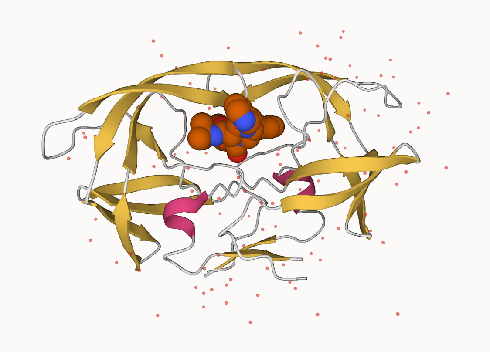

<!DOCTYPE html>
<html xmlns="http://www.w3.org/1999/xhtml" lang="en" xml:lang="en"><head>

<meta charset="utf-8">
<meta name="generator" content="quarto-1.1.189">

<meta name="viewport" content="width=device-width, initial-scale=1.0, user-scalable=yes">

<meta name="author" content="Karen Guerrero">

<title>Lab9</title>

<link href="Lab9_files/libs/quarto-html/tippy.css" rel="stylesheet">
<link href="Lab9_files/libs/quarto-html/quarto-syntax-highlighting.css" rel="stylesheet" id="quarto-text-highlighting-styles">

<link href="Lab9_files/libs/bootstrap/bootstrap-icons.css" rel="stylesheet">
<link href="Lab9_files/libs/bootstrap/bootstrap.min.css" rel="stylesheet" id="quarto-bootstrap" data-mode="light">

</head>

<body class="fullcontent">

<main class="content" id="quarto-document-content">

<header id="title-block-header" class="quarto-title-block default">

<h1 class="title">Lab9</h1>

    

    
Author

    

             
Karen Guerrero 

          

  

    
    
  

  

</header>

<pre class="sourceCode r code-with-copy"><code class="sourceCode r">PDB_data &lt;- "Data_Export_Summary.csv"
PDB_data</code><button title="Copy to Clipboard" class="code-copy-button"><i class="bi"></i></button></pre>

<pre><code>[1] "Data_Export_Summary.csv"</code></pre>

<pre class="sourceCode r code-with-copy"><code class="sourceCode r">PDB &lt;- read.csv(PDB_data)
PDB</code><button title="Copy to Clipboard" class="code-copy-button"><i class="bi"></i></button></pre>

<pre><code>           Molecular.Type   X.ray    NMR    EM Multiple.methods Neutron Other
1          Protein (only) 150,417 12,056 8,586              188      72    32
2 Protein/Oligosaccharide   8,869     32 1,552                6       0     0
3              Protein/NA   7,943    280 2,690                6       0     0
4     Nucleic acid (only)   2,522  1,425    74               13       2     1
5                   Other     154     31     6                0       0     0
6  Oligosaccharide (only)      11      6     0                1       0     4
    Total
1 171,351
2  10,459
3  10,919
4   4,037
5     191
6      22</code></pre>

<pre class="sourceCode r code-with-copy"><code class="sourceCode r">PDB$Multiple.methods &lt;- as.numeric(gsub(",", "", PDB$Multiple.methods))
PDB$Neutron &lt;- as.numeric(gsub(",", "", PDB$Neutron))
PDB$X.ray &lt;- as.numeric(gsub(",", "", PDB$X.ray))
PDB$NMR &lt;- as.numeric(gsub(",", "", PDB$NMR))
PDB$EM &lt;- as.numeric(gsub(",", "", PDB$EM))
PDB$Total &lt;- as.numeric(gsub(",", "", PDB$Total))</code><button title="Copy to Clipboard" class="code-copy-button"><i class="bi"></i></button></pre>

<pre class="sourceCode r code-with-copy"><code class="sourceCode r">(sum(PDB$X.ray)/sum(PDB$Total))*100</code><button title="Copy to Clipboard" class="code-copy-button"><i class="bi"></i></button></pre>

<pre><code>[1] 86.26097</code></pre>

<pre class="sourceCode r code-with-copy"><code class="sourceCode r">(sum(PDB$EM)/sum(PDB$Total))*100</code><button title="Copy to Clipboard" class="code-copy-button"><i class="bi"></i></button></pre>

<pre><code>[1] 6.552983</code></pre>

##Q1: What percentage of structures in the PDB are solved by X-Ray and Electron Microscopy? The percentage of structures in the PDB that are solved by X-ray is 86.26097% and the percentage of structures solved by Electron Microscopy is 6.552983%.

##Q2: What proportion of structures in the PDB are protein?

The proportion of structures in the PDB that are protein is 0.8698948.

<pre class="sourceCode r code-with-copy"><code class="sourceCode r">PDB$Total[1]/sum(PDB$Total)</code><button title="Copy to Clipboard" class="code-copy-button"><i class="bi"></i></button></pre>

<pre><code>[1] 0.8698948</code></pre>

##Q3: Type HIV in the PDB website search box on the home page and determine how many HIV-1 protease structures are in the current PDB?

There are 4,707 protease structures in the current PDB.

#Viewing PDB structures with Molstart

<section id="reading-and-working-with-structures-in-r" class="level1">
<h1>Reading and working with structures in R</h1>

The ‘bio3d’ package for structural bioinformatics has lot’s of features for reading and working with biomolecular sequences and structures.

<pre class="sourceCode r code-with-copy"><code class="sourceCode r">library(bio3d)
pdb &lt;- read.pdb("1hsg")</code><button title="Copy to Clipboard" class="code-copy-button"><i class="bi"></i></button></pre>

<pre><code>  Note: Accessing on-line PDB file</code></pre>

<pre class="sourceCode r code-with-copy"><code class="sourceCode r">pdb</code><button title="Copy to Clipboard" class="code-copy-button"><i class="bi"></i></button></pre>

<pre><code>
 Call:  read.pdb(file = "1hsg")

   Total Models#: 1
     Total Atoms#: 1686,  XYZs#: 5058  Chains#: 2  (values: A B)

     Protein Atoms#: 1514  (residues/Calpha atoms#: 198)
     Nucleic acid Atoms#: 0  (residues/phosphate atoms#: 0)

     Non-protein/nucleic Atoms#: 172  (residues: 128)
     Non-protein/nucleic resid values: [ HOH (127), MK1 (1) ]

   Protein sequence:
      PQITLWQRPLVTIKIGGQLKEALLDTGADDTVLEEMSLPGRWKPKMIGGIGGFIKVRQYD
      QILIEICGHKAIGTVLVGPTPVNIIGRNLLTQIGCTLNFPQITLWQRPLVTIKIGGQLKE
      ALLDTGADDTVLEEMSLPGRWKPKMIGGIGGFIKVRQYDQILIEICGHKAIGTVLVGPTP
      VNIIGRNLLTQIGCTLNF

+ attr: atom, xyz, seqres, helix, sheet,
        calpha, remark, call</code></pre>

##Q7: How many amino acid residues are there in this pdb object? There are 198 amino acid residues in this pdb object.

##Q8: Name one of the two non-protein residues? HOH is the name of one of the two non-protein residues.

##Q9: How many protein chains are in this structure? There are two protein chains in this structure.

<pre class="sourceCode r code-with-copy"><code class="sourceCode r">attributes(pdb)</code><button title="Copy to Clipboard" class="code-copy-button"><i class="bi"></i></button></pre>

<pre><code>$names
[1] "atom"   "xyz"    "seqres" "helix"  "sheet"  "calpha" "remark" "call"  

$class
[1] "pdb" "sse"</code></pre>

<pre class="sourceCode r code-with-copy"><code class="sourceCode r">head(pdb$atom)</code><button title="Copy to Clipboard" class="code-copy-button"><i class="bi"></i></button></pre>

<pre><code>  type eleno elety  alt resid chain resno insert      x      y     z o     b
1 ATOM     1     N &lt;NA&gt;   PRO     A     1   &lt;NA&gt; 29.361 39.686 5.862 1 38.10
2 ATOM     2    CA &lt;NA&gt;   PRO     A     1   &lt;NA&gt; 30.307 38.663 5.319 1 40.62
3 ATOM     3     C &lt;NA&gt;   PRO     A     1   &lt;NA&gt; 29.760 38.071 4.022 1 42.64
4 ATOM     4     O &lt;NA&gt;   PRO     A     1   &lt;NA&gt; 28.600 38.302 3.676 1 43.40
5 ATOM     5    CB &lt;NA&gt;   PRO     A     1   &lt;NA&gt; 30.508 37.541 6.342 1 37.87
6 ATOM     6    CG &lt;NA&gt;   PRO     A     1   &lt;NA&gt; 29.296 37.591 7.162 1 38.40
  segid elesy charge
1  &lt;NA&gt;     N   &lt;NA&gt;
2  &lt;NA&gt;     C   &lt;NA&gt;
3  &lt;NA&gt;     C   &lt;NA&gt;
4  &lt;NA&gt;     O   &lt;NA&gt;
5  &lt;NA&gt;     C   &lt;NA&gt;
6  &lt;NA&gt;     C   &lt;NA&gt;</code></pre>

<pre class="sourceCode r code-with-copy"><code class="sourceCode r">adk &lt;- read.pdb("6s36")</code><button title="Copy to Clipboard" class="code-copy-button"><i class="bi"></i></button></pre>

<pre><code>  Note: Accessing on-line PDB file
   PDB has ALT records, taking A only, rm.alt=TRUE</code></pre>

<pre class="sourceCode r code-with-copy"><code class="sourceCode r">adk</code><button title="Copy to Clipboard" class="code-copy-button"><i class="bi"></i></button></pre>

<pre><code>
 Call:  read.pdb(file = "6s36")

   Total Models#: 1
     Total Atoms#: 1898,  XYZs#: 5694  Chains#: 1  (values: A)

     Protein Atoms#: 1654  (residues/Calpha atoms#: 214)
     Nucleic acid Atoms#: 0  (residues/phosphate atoms#: 0)

     Non-protein/nucleic Atoms#: 244  (residues: 244)
     Non-protein/nucleic resid values: [ CL (3), HOH (238), MG (2), NA (1) ]

   Protein sequence:
      MRIILLGAPGAGKGTQAQFIMEKYGIPQISTGDMLRAAVKSGSELGKQAKDIMDAGKLVT
      DELVIALVKERIAQEDCRNGFLLDGFPRTIPQADAMKEAGINVDYVLEFDVPDELIVDKI
      VGRRVHAPSGRVYHVKFNPPKVEGKDDVTGEELTTRKDDQEETVRKRLVEYHQMTAPLIG
      YYSKEAEAGNTKYAKVDGTKPVAEVRADLEKILG

+ attr: atom, xyz, seqres, helix, sheet,
        calpha, remark, call</code></pre>

Normal mode analysis (NMA) it is a bioinformatics method for prediciting functional motions. It will show us the parts of the protein that are “flexible” (i.e.&nbsp;most dynamic)

<pre class="sourceCode r code-with-copy"><code class="sourceCode r"># Perform flexiblity prediction
m &lt;- nma(adk)</code><button title="Copy to Clipboard" class="code-copy-button"><i class="bi"></i></button></pre>

<pre><code> Building Hessian...        Done in 0.085 seconds.
 Diagonalizing Hessian...   Done in 0.254 seconds.</code></pre>

<pre class="sourceCode r code-with-copy"><code class="sourceCode r">plot(m)</code><button title="Copy to Clipboard" class="code-copy-button"><i class="bi"></i></button></pre>

<pre class="sourceCode r code-with-copy"><code class="sourceCode r">mktrj(m, file="adk_m7.pdb")</code><button title="Copy to Clipboard" class="code-copy-button"><i class="bi"></i></button></pre>

<pre class="sourceCode r code-with-copy"><code class="sourceCode r">## Install packages in the R console NOT your Rmd/Quarto file

# install.packages("bio3d")
# install.packages("devtools")
# install.packages("BiocManager")

# BiocManager::install("msa")
# devtools::install_bitbucket("Grantlab/bio3d-view")</code><button title="Copy to Clipboard" class="code-copy-button"><i class="bi"></i></button></pre>

##Q10. Which of the packages above is found only on BioConductor and not CRAN?

The packages only found on BioConductor and not CRAN is msa.

##Q11. Which of the above packages is not found on BioConductor or CRAN? The package that is not found on BioConductor or CRAN is bio3d-view.

##Q12. True or False? Functions from the devtools package can be used to install packages from GitHub and BitBucket? True

#Compartive analysis of all ADK structures First we get the sequence of ADK and use this to search the PDB database.

<pre class="sourceCode r code-with-copy"><code class="sourceCode r">library(bio3d)</code><button title="Copy to Clipboard" class="code-copy-button"><i class="bi"></i></button></pre>

<pre class="sourceCode r code-with-copy"><code class="sourceCode r">aa &lt;- get.seq("1ake_A")</code><button title="Copy to Clipboard" class="code-copy-button"><i class="bi"></i></button></pre>

<pre><code>Warning in get.seq("1ake_A"): Removing existing file: seqs.fasta</code></pre>

<pre><code>Fetching... Please wait. Done.</code></pre>

<pre class="sourceCode r code-with-copy"><code class="sourceCode r">aa</code><button title="Copy to Clipboard" class="code-copy-button"><i class="bi"></i></button></pre>

<pre><code>             1        .         .         .         .         .         60 
pdb|1AKE|A   MRIILLGAPGAGKGTQAQFIMEKYGIPQISTGDMLRAAVKSGSELGKQAKDIMDAGKLVT
             1        .         .         .         .         .         60 

            61        .         .         .         .         .         120 
pdb|1AKE|A   DELVIALVKERIAQEDCRNGFLLDGFPRTIPQADAMKEAGINVDYVLEFDVPDELIVDRI
            61        .         .         .         .         .         120 

           121        .         .         .         .         .         180 
pdb|1AKE|A   VGRRVHAPSGRVYHVKFNPPKVEGKDDVTGEELTTRKDDQEETVRKRLVEYHQMTAPLIG
           121        .         .         .         .         .         180 

           181        .         .         .   214 
pdb|1AKE|A   YYSKEAEAGNTKYAKVDGTKPVAEVRADLEKILG
           181        .         .         .   214 

Call:
  read.fasta(file = outfile)

Class:
  fasta

Alignment dimensions:
  1 sequence rows; 214 position columns (214 non-gap, 0 gap) 

+ attr: id, ali, call</code></pre>

##Q13. How many amino acids are in this sequence, i.e.&nbsp;how long is this sequence? There are 214 amino acids in this sequence.

<pre class="sourceCode r code-with-copy"><code class="sourceCode r">#Blast or hmmer search
b &lt;- blast.pdb(aa)</code><button title="Copy to Clipboard" class="code-copy-button"><i class="bi"></i></button></pre>

<pre><code> Searching ... please wait (updates every 5 seconds) RID = PSHC4FXY016 
 .
 Reporting 98 hits</code></pre>

<pre class="sourceCode r code-with-copy"><code class="sourceCode r"># Plot a summary of search results</code><button title="Copy to Clipboard" class="code-copy-button"><i class="bi"></i></button></pre>

<pre class="sourceCode r code-with-copy"><code class="sourceCode r">hits &lt;- plot(b)</code><button title="Copy to Clipboard" class="code-copy-button"><i class="bi"></i></button></pre>

<pre><code>  * Possible cutoff values:    197 -3 
            Yielding Nhits:    16 98 

  * Chosen cutoff value of:    197 
            Yielding Nhits:    16 </code></pre>

<pre class="sourceCode r code-with-copy"><code class="sourceCode r"># List out some 'top hits'
head(hits$pdb.id)</code><button title="Copy to Clipboard" class="code-copy-button"><i class="bi"></i></button></pre>

<pre><code>[1] "1AKE_A" "4X8M_A" "6S36_A" "6RZE_A" "4X8H_A" "3HPR_A"</code></pre>

<pre class="sourceCode r code-with-copy"><code class="sourceCode r">hits &lt;- NULL
hits$pdb.id &lt;- c('1AKE_A','6S36_A','6RZE_A','3HPR_A','1E4V_A','5EJE_A','1E4Y_A','3X2S_A','6HAP_A','6HAM_A','4K46_A','3GMT_A','4PZL_A')</code><button title="Copy to Clipboard" class="code-copy-button"><i class="bi"></i></button></pre>

<pre class="sourceCode r code-with-copy"><code class="sourceCode r"># Download releated PDB files
files &lt;- get.pdb(hits$pdb.id, path="pdbs", split=TRUE, gzip=TRUE)</code><button title="Copy to Clipboard" class="code-copy-button"><i class="bi"></i></button></pre>

<pre><code>Warning in get.pdb(hits$pdb.id, path = "pdbs", split = TRUE, gzip = TRUE): pdbs/
1AKE.pdb.gz exists. Skipping download</code></pre>

<pre><code>Warning in get.pdb(hits$pdb.id, path = "pdbs", split = TRUE, gzip = TRUE): pdbs/
6S36.pdb.gz exists. Skipping download</code></pre>

<pre><code>Warning in get.pdb(hits$pdb.id, path = "pdbs", split = TRUE, gzip = TRUE): pdbs/
6RZE.pdb.gz exists. Skipping download</code></pre>

<pre><code>Warning in get.pdb(hits$pdb.id, path = "pdbs", split = TRUE, gzip = TRUE): pdbs/
3HPR.pdb.gz exists. Skipping download</code></pre>

<pre><code>Warning in get.pdb(hits$pdb.id, path = "pdbs", split = TRUE, gzip = TRUE): pdbs/
1E4V.pdb.gz exists. Skipping download</code></pre>

<pre><code>Warning in get.pdb(hits$pdb.id, path = "pdbs", split = TRUE, gzip = TRUE): pdbs/
5EJE.pdb.gz exists. Skipping download</code></pre>

<pre><code>Warning in get.pdb(hits$pdb.id, path = "pdbs", split = TRUE, gzip = TRUE): pdbs/
1E4Y.pdb.gz exists. Skipping download</code></pre>

<pre><code>Warning in get.pdb(hits$pdb.id, path = "pdbs", split = TRUE, gzip = TRUE): pdbs/
3X2S.pdb.gz exists. Skipping download</code></pre>

<pre><code>Warning in get.pdb(hits$pdb.id, path = "pdbs", split = TRUE, gzip = TRUE): pdbs/
6HAP.pdb.gz exists. Skipping download</code></pre>

<pre><code>Warning in get.pdb(hits$pdb.id, path = "pdbs", split = TRUE, gzip = TRUE): pdbs/
6HAM.pdb.gz exists. Skipping download</code></pre>

<pre><code>Warning in get.pdb(hits$pdb.id, path = "pdbs", split = TRUE, gzip = TRUE): pdbs/
4K46.pdb.gz exists. Skipping download</code></pre>

<pre><code>Warning in get.pdb(hits$pdb.id, path = "pdbs", split = TRUE, gzip = TRUE): pdbs/
3GMT.pdb.gz exists. Skipping download</code></pre>

<pre><code>Warning in get.pdb(hits$pdb.id, path = "pdbs", split = TRUE, gzip = TRUE): pdbs/
4PZL.pdb.gz exists. Skipping download</code></pre>

<pre><code>
  |                                                                            
  |                                                                      |   0%
  |                                                                            
  |=====                                                                 |   8%
  |                                                                            
  |===========                                                           |  15%
  |                                                                            
  |================                                                      |  23%
  |                                                                            
  |======================                                                |  31%
  |                                                                            
  |===========================                                           |  38%
  |                                                                            
  |================================                                      |  46%
  |                                                                            
  |======================================                                |  54%
  |                                                                            
  |===========================================                           |  62%
  |                                                                            
  |================================================                      |  69%
  |                                                                            
  |======================================================                |  77%
  |                                                                            
  |===========================================================           |  85%
  |                                                                            
  |=================================================================     |  92%
  |                                                                            
  |======================================================================| 100%</code></pre>

Viewing all these structures looks like a HOT mess! We need to try something else…

We will align and supperpose these structures.

<pre class="sourceCode r code-with-copy"><code class="sourceCode r"># Align releated PDBs
pdbs &lt;- pdbaln(files, fit = TRUE, exefile="msa")</code><button title="Copy to Clipboard" class="code-copy-button"><i class="bi"></i></button></pre>

<pre><code>Reading PDB files:
pdbs/split_chain/1AKE_A.pdb
pdbs/split_chain/6S36_A.pdb
pdbs/split_chain/6RZE_A.pdb
pdbs/split_chain/3HPR_A.pdb
pdbs/split_chain/1E4V_A.pdb
pdbs/split_chain/5EJE_A.pdb
pdbs/split_chain/1E4Y_A.pdb
pdbs/split_chain/3X2S_A.pdb
pdbs/split_chain/6HAP_A.pdb
pdbs/split_chain/6HAM_A.pdb
pdbs/split_chain/4K46_A.pdb
pdbs/split_chain/3GMT_A.pdb
pdbs/split_chain/4PZL_A.pdb
   PDB has ALT records, taking A only, rm.alt=TRUE
.   PDB has ALT records, taking A only, rm.alt=TRUE
.   PDB has ALT records, taking A only, rm.alt=TRUE
.   PDB has ALT records, taking A only, rm.alt=TRUE
..   PDB has ALT records, taking A only, rm.alt=TRUE
....   PDB has ALT records, taking A only, rm.alt=TRUE
.   PDB has ALT records, taking A only, rm.alt=TRUE
...

Extracting sequences

pdb/seq: 1   name: pdbs/split_chain/1AKE_A.pdb 
   PDB has ALT records, taking A only, rm.alt=TRUE
pdb/seq: 2   name: pdbs/split_chain/6S36_A.pdb 
   PDB has ALT records, taking A only, rm.alt=TRUE
pdb/seq: 3   name: pdbs/split_chain/6RZE_A.pdb 
   PDB has ALT records, taking A only, rm.alt=TRUE
pdb/seq: 4   name: pdbs/split_chain/3HPR_A.pdb 
   PDB has ALT records, taking A only, rm.alt=TRUE
pdb/seq: 5   name: pdbs/split_chain/1E4V_A.pdb 
pdb/seq: 6   name: pdbs/split_chain/5EJE_A.pdb 
   PDB has ALT records, taking A only, rm.alt=TRUE
pdb/seq: 7   name: pdbs/split_chain/1E4Y_A.pdb 
pdb/seq: 8   name: pdbs/split_chain/3X2S_A.pdb 
pdb/seq: 9   name: pdbs/split_chain/6HAP_A.pdb 
pdb/seq: 10   name: pdbs/split_chain/6HAM_A.pdb 
   PDB has ALT records, taking A only, rm.alt=TRUE
pdb/seq: 11   name: pdbs/split_chain/4K46_A.pdb 
   PDB has ALT records, taking A only, rm.alt=TRUE
pdb/seq: 12   name: pdbs/split_chain/3GMT_A.pdb 
pdb/seq: 13   name: pdbs/split_chain/4PZL_A.pdb </code></pre>

<pre class="sourceCode r code-with-copy"><code class="sourceCode r">pdbs</code><button title="Copy to Clipboard" class="code-copy-button"><i class="bi"></i></button></pre>

<pre><code>                                1        .         .         .         40 
[Truncated_Name:1]1AKE_A.pdb    ----------MRIILLGAPGAGKGTQAQFIMEKYGIPQIS
[Truncated_Name:2]6S36_A.pdb    ----------MRIILLGAPGAGKGTQAQFIMEKYGIPQIS
[Truncated_Name:3]6RZE_A.pdb    ----------MRIILLGAPGAGKGTQAQFIMEKYGIPQIS
[Truncated_Name:4]3HPR_A.pdb    ----------MRIILLGAPGAGKGTQAQFIMEKYGIPQIS
[Truncated_Name:5]1E4V_A.pdb    ----------MRIILLGAPVAGKGTQAQFIMEKYGIPQIS
[Truncated_Name:6]5EJE_A.pdb    ----------MRIILLGAPGAGKGTQAQFIMEKYGIPQIS
[Truncated_Name:7]1E4Y_A.pdb    ----------MRIILLGALVAGKGTQAQFIMEKYGIPQIS
[Truncated_Name:8]3X2S_A.pdb    ----------MRIILLGAPGAGKGTQAQFIMEKYGIPQIS
[Truncated_Name:9]6HAP_A.pdb    ----------MRIILLGAPGAGKGTQAQFIMEKYGIPQIS
[Truncated_Name:10]6HAM_A.pdb   ----------MRIILLGAPGAGKGTQAQFIMEKYGIPQIS
[Truncated_Name:11]4K46_A.pdb   ----------MRIILLGAPGAGKGTQAQFIMAKFGIPQIS
[Truncated_Name:12]3GMT_A.pdb   ----------MRLILLGAPGAGKGTQANFIKEKFGIPQIS
[Truncated_Name:13]4PZL_A.pdb   TENLYFQSNAMRIILLGAPGAGKGTQAKIIEQKYNIAHIS
                                          **^*****  *******  *  *^ *  ** 
                                1        .         .         .         40 

                               41        .         .         .         80 
[Truncated_Name:1]1AKE_A.pdb    TGDMLRAAVKSGSELGKQAKDIMDAGKLVTDELVIALVKE
[Truncated_Name:2]6S36_A.pdb    TGDMLRAAVKSGSELGKQAKDIMDAGKLVTDELVIALVKE
[Truncated_Name:3]6RZE_A.pdb    TGDMLRAAVKSGSELGKQAKDIMDAGKLVTDELVIALVKE
[Truncated_Name:4]3HPR_A.pdb    TGDMLRAAVKSGSELGKQAKDIMDAGKLVTDELVIALVKE
[Truncated_Name:5]1E4V_A.pdb    TGDMLRAAVKSGSELGKQAKDIMDAGKLVTDELVIALVKE
[Truncated_Name:6]5EJE_A.pdb    TGDMLRAAVKSGSELGKQAKDIMDACKLVTDELVIALVKE
[Truncated_Name:7]1E4Y_A.pdb    TGDMLRAAVKSGSELGKQAKDIMDAGKLVTDELVIALVKE
[Truncated_Name:8]3X2S_A.pdb    TGDMLRAAVKSGSELGKQAKDIMDCGKLVTDELVIALVKE
[Truncated_Name:9]6HAP_A.pdb    TGDMLRAAVKSGSELGKQAKDIMDAGKLVTDELVIALVRE
[Truncated_Name:10]6HAM_A.pdb   TGDMLRAAIKSGSELGKQAKDIMDAGKLVTDEIIIALVKE
[Truncated_Name:11]4K46_A.pdb   TGDMLRAAIKAGTELGKQAKSVIDAGQLVSDDIILGLVKE
[Truncated_Name:12]3GMT_A.pdb   TGDMLRAAVKAGTPLGVEAKTYMDEGKLVPDSLIIGLVKE
[Truncated_Name:13]4PZL_A.pdb   TGDMIRETIKSGSALGQELKKVLDAGELVSDEFIIKIVKD
                                ****^*  ^* *^ **   *  ^*   ** *  ^^ ^*^^ 
                               41        .         .         .         80 

                               81        .         .         .         120 
[Truncated_Name:1]1AKE_A.pdb    RIAQEDCRNGFLLDGFPRTIPQADAMKEAGINVDYVLEFD
[Truncated_Name:2]6S36_A.pdb    RIAQEDCRNGFLLDGFPRTIPQADAMKEAGINVDYVLEFD
[Truncated_Name:3]6RZE_A.pdb    RIAQEDCRNGFLLDGFPRTIPQADAMKEAGINVDYVLEFD
[Truncated_Name:4]3HPR_A.pdb    RIAQEDCRNGFLLDGFPRTIPQADAMKEAGINVDYVLEFD
[Truncated_Name:5]1E4V_A.pdb    RIAQEDCRNGFLLDGFPRTIPQADAMKEAGINVDYVLEFD
[Truncated_Name:6]5EJE_A.pdb    RIAQEDCRNGFLLDGFPRTIPQADAMKEAGINVDYVLEFD
[Truncated_Name:7]1E4Y_A.pdb    RIAQEDCRNGFLLDGFPRTIPQADAMKEAGINVDYVLEFD
[Truncated_Name:8]3X2S_A.pdb    RIAQEDSRNGFLLDGFPRTIPQADAMKEAGINVDYVLEFD
[Truncated_Name:9]6HAP_A.pdb    RICQEDSRNGFLLDGFPRTIPQADAMKEAGINVDYVLEFD
[Truncated_Name:10]6HAM_A.pdb   RICQEDSRNGFLLDGFPRTIPQADAMKEAGINVDYVLEFD
[Truncated_Name:11]4K46_A.pdb   RIAQDDCAKGFLLDGFPRTIPQADGLKEVGVVVDYVIEFD
[Truncated_Name:12]3GMT_A.pdb   RLKEADCANGYLFDGFPRTIAQADAMKEAGVAIDYVLEID
[Truncated_Name:13]4PZL_A.pdb   RISKNDCNNGFLLDGVPRTIPQAQELDKLGVNIDYIVEVD
                                *^   *   *^* ** **** **  ^   *^ ^**^^* * 
                               81        .         .         .         120 

                              121        .         .         .         160 
[Truncated_Name:1]1AKE_A.pdb    VPDELIVDRIVGRRVHAPSGRVYHVKFNPPKVEGKDDVTG
[Truncated_Name:2]6S36_A.pdb    VPDELIVDKIVGRRVHAPSGRVYHVKFNPPKVEGKDDVTG
[Truncated_Name:3]6RZE_A.pdb    VPDELIVDAIVGRRVHAPSGRVYHVKFNPPKVEGKDDVTG
[Truncated_Name:4]3HPR_A.pdb    VPDELIVDRIVGRRVHAPSGRVYHVKFNPPKVEGKDDGTG
[Truncated_Name:5]1E4V_A.pdb    VPDELIVDRIVGRRVHAPSGRVYHVKFNPPKVEGKDDVTG
[Truncated_Name:6]5EJE_A.pdb    VPDELIVDRIVGRRVHAPSGRVYHVKFNPPKVEGKDDVTG
[Truncated_Name:7]1E4Y_A.pdb    VPDELIVDRIVGRRVHAPSGRVYHVKFNPPKVEGKDDVTG
[Truncated_Name:8]3X2S_A.pdb    VPDELIVDRIVGRRVHAPSGRVYHVKFNPPKVEGKDDVTG
[Truncated_Name:9]6HAP_A.pdb    VPDELIVDRIVGRRVHAPSGRVYHVKFNPPKVEGKDDVTG
[Truncated_Name:10]6HAM_A.pdb   VPDELIVDRIVGRRVHAPSGRVYHVKFNPPKVEGKDDVTG
[Truncated_Name:11]4K46_A.pdb   VADSVIVERMAGRRAHLASGRTYHNVYNPPKVEGKDDVTG
[Truncated_Name:12]3GMT_A.pdb   VPFSEIIERMSGRRTHPASGRTYHVKFNPPKVEGKDDVTG
[Truncated_Name:13]4PZL_A.pdb   VADNLLIERITGRRIHPASGRTYHTKFNPPKVADKDDVTG
                                *    ^^^ ^ *** *  *** **  ^*****  *** ** 
                              121        .         .         .         160 

                              161        .         .         .         200 
[Truncated_Name:1]1AKE_A.pdb    EELTTRKDDQEETVRKRLVEYHQMTAPLIGYYSKEAEAGN
[Truncated_Name:2]6S36_A.pdb    EELTTRKDDQEETVRKRLVEYHQMTAPLIGYYSKEAEAGN
[Truncated_Name:3]6RZE_A.pdb    EELTTRKDDQEETVRKRLVEYHQMTAPLIGYYSKEAEAGN
[Truncated_Name:4]3HPR_A.pdb    EELTTRKDDQEETVRKRLVEYHQMTAPLIGYYSKEAEAGN
[Truncated_Name:5]1E4V_A.pdb    EELTTRKDDQEETVRKRLVEYHQMTAPLIGYYSKEAEAGN
[Truncated_Name:6]5EJE_A.pdb    EELTTRKDDQEECVRKRLVEYHQMTAPLIGYYSKEAEAGN
[Truncated_Name:7]1E4Y_A.pdb    EELTTRKDDQEETVRKRLVEYHQMTAPLIGYYSKEAEAGN
[Truncated_Name:8]3X2S_A.pdb    EELTTRKDDQEETVRKRLCEYHQMTAPLIGYYSKEAEAGN
[Truncated_Name:9]6HAP_A.pdb    EELTTRKDDQEETVRKRLVEYHQMTAPLIGYYSKEAEAGN
[Truncated_Name:10]6HAM_A.pdb   EELTTRKDDQEETVRKRLVEYHQMTAPLIGYYSKEAEAGN
[Truncated_Name:11]4K46_A.pdb   EDLVIREDDKEETVLARLGVYHNQTAPLIAYYGKEAEAGN
[Truncated_Name:12]3GMT_A.pdb   EPLVQRDDDKEETVKKRLDVYEAQTKPLITYYGDWARRGA
[Truncated_Name:13]4PZL_A.pdb   EPLITRTDDNEDTVKQRLSVYHAQTAKLIDFYRNFSSTNT
                                * *  * ** *^ *  **  *   *  ** ^*         
                              161        .         .         .         200 

                              201        .         .      227 
[Truncated_Name:1]1AKE_A.pdb    T--KYAKVDGTKPVAEVRADLEKILG-
[Truncated_Name:2]6S36_A.pdb    T--KYAKVDGTKPVAEVRADLEKILG-
[Truncated_Name:3]6RZE_A.pdb    T--KYAKVDGTKPVAEVRADLEKILG-
[Truncated_Name:4]3HPR_A.pdb    T--KYAKVDGTKPVAEVRADLEKILG-
[Truncated_Name:5]1E4V_A.pdb    T--KYAKVDGTKPVAEVRADLEKILG-
[Truncated_Name:6]5EJE_A.pdb    T--KYAKVDGTKPVAEVRADLEKILG-
[Truncated_Name:7]1E4Y_A.pdb    T--KYAKVDGTKPVAEVRADLEKILG-
[Truncated_Name:8]3X2S_A.pdb    T--KYAKVDGTKPVAEVRADLEKILG-
[Truncated_Name:9]6HAP_A.pdb    T--KYAKVDGTKPVCEVRADLEKILG-
[Truncated_Name:10]6HAM_A.pdb   T--KYAKVDGTKPVCEVRADLEKILG-
[Truncated_Name:11]4K46_A.pdb   T--QYLKFDGTKAVAEVSAELEKALA-
[Truncated_Name:12]3GMT_A.pdb   E-------NGLKAPA-----YRKISG-
[Truncated_Name:13]4PZL_A.pdb   KIPKYIKINGDQAVEKVSQDIFDQLNK
                                         *                  
                              201        .         .      227 

Call:
  pdbaln(files = files, fit = TRUE, exefile = "msa")

Class:
  pdbs, fasta

Alignment dimensions:
  13 sequence rows; 227 position columns (204 non-gap, 23 gap) 

+ attr: xyz, resno, b, chain, id, ali, resid, sse, call</code></pre>

<pre class="sourceCode r code-with-copy"><code class="sourceCode r"># Vector containing PDB codes for figure axis
ids &lt;- basename.pdb(pdbs$id)

# Draw schematic alignment (RStudio stated that image was too large when file was Render)
#plot(pdbs, labels=ids)</code><button title="Copy to Clipboard" class="code-copy-button"><i class="bi"></i></button></pre>

<pre class="sourceCode r code-with-copy"><code class="sourceCode r">anno &lt;- pdb.annotate(ids)
unique(anno$source)</code><button title="Copy to Clipboard" class="code-copy-button"><i class="bi"></i></button></pre>

<pre><code>[1] "Escherichia coli"                                
[2] "Escherichia coli K-12"                           
[3] "Escherichia coli O139:H28 str. E24377A"          
[4] "Escherichia coli str. K-12 substr. MDS42"        
[5] "Photobacterium profundum"                        
[6] "Burkholderia pseudomallei 1710b"                 
[7] "Francisella tularensis subsp. tularensis SCHU S4"</code></pre>

<pre class="sourceCode r code-with-copy"><code class="sourceCode r">anno</code><button title="Copy to Clipboard" class="code-copy-button"><i class="bi"></i></button></pre>

<pre><code>       structureId chainId macromoleculeType chainLength experimentalTechnique
1AKE_A        1AKE       A           Protein         214                 X-ray
6S36_A        6S36       A           Protein         214                 X-ray
6RZE_A        6RZE       A           Protein         214                 X-ray
3HPR_A        3HPR       A           Protein         214                 X-ray
1E4V_A        1E4V       A           Protein         214                 X-ray
5EJE_A        5EJE       A           Protein         214                 X-ray
1E4Y_A        1E4Y       A           Protein         214                 X-ray
3X2S_A        3X2S       A           Protein         214                 X-ray
6HAP_A        6HAP       A           Protein         214                 X-ray
6HAM_A        6HAM       A           Protein         214                 X-ray
4K46_A        4K46       A           Protein         214                 X-ray
3GMT_A        3GMT       A           Protein         230                 X-ray
4PZL_A        4PZL       A           Protein         242                 X-ray
       resolution       scopDomain                   pfam         ligandId
1AKE_A       2.00 Adenylate kinase Adenylate kinase (ADK)              AP5
6S36_A       1.60             &lt;NA&gt; Adenylate kinase (ADK) CL (3),NA,MG (2)
6RZE_A       1.69             &lt;NA&gt; Adenylate kinase (ADK)    NA (3),CL (2)
3HPR_A       2.00             &lt;NA&gt; Adenylate kinase (ADK)              AP5
1E4V_A       1.85 Adenylate kinase Adenylate kinase (ADK)              AP5
5EJE_A       1.90             &lt;NA&gt; Adenylate kinase (ADK)           AP5,CO
1E4Y_A       1.85 Adenylate kinase Adenylate kinase (ADK)              AP5
3X2S_A       2.80             &lt;NA&gt; Adenylate kinase (ADK)   JPY (2),AP5,MG
6HAP_A       2.70             &lt;NA&gt; Adenylate kinase (ADK)              AP5
6HAM_A       2.55             &lt;NA&gt; Adenylate kinase (ADK)              AP5
4K46_A       2.01             &lt;NA&gt; Adenylate kinase (ADK)      ADP,AMP,PO4
3GMT_A       2.10             &lt;NA&gt; Adenylate kinase (ADK)          SO4 (2)
4PZL_A       2.10             &lt;NA&gt; Adenylate kinase (ADK)       CA,FMT,GOL
                                                                             ligandName
1AKE_A                                                 BIS(ADENOSINE)-5'-PENTAPHOSPHATE
6S36_A                                    CHLORIDE ION (3),SODIUM ION,MAGNESIUM ION (2)
6RZE_A                                                  SODIUM ION (3),CHLORIDE ION (2)
3HPR_A                                                 BIS(ADENOSINE)-5'-PENTAPHOSPHATE
1E4V_A                                                 BIS(ADENOSINE)-5'-PENTAPHOSPHATE
5EJE_A                                 BIS(ADENOSINE)-5'-PENTAPHOSPHATE,COBALT (II) ION
1E4Y_A                                                 BIS(ADENOSINE)-5'-PENTAPHOSPHATE
3X2S_A N-(pyren-1-ylmethyl)acetamide (2),BIS(ADENOSINE)-5'-PENTAPHOSPHATE,MAGNESIUM ION
6HAP_A                                                 BIS(ADENOSINE)-5'-PENTAPHOSPHATE
6HAM_A                                                 BIS(ADENOSINE)-5'-PENTAPHOSPHATE
4K46_A                   ADENOSINE-5'-DIPHOSPHATE,ADENOSINE MONOPHOSPHATE,PHOSPHATE ION
3GMT_A                                                                  SULFATE ION (2)
4PZL_A                                                 CALCIUM ION,FORMIC ACID,GLYCEROL
                                                 source
1AKE_A                                 Escherichia coli
6S36_A                                 Escherichia coli
6RZE_A                                 Escherichia coli
3HPR_A                            Escherichia coli K-12
1E4V_A                                 Escherichia coli
5EJE_A           Escherichia coli O139:H28 str. E24377A
1E4Y_A                                 Escherichia coli
3X2S_A         Escherichia coli str. K-12 substr. MDS42
6HAP_A           Escherichia coli O139:H28 str. E24377A
6HAM_A                            Escherichia coli K-12
4K46_A                         Photobacterium profundum
3GMT_A                  Burkholderia pseudomallei 1710b
4PZL_A Francisella tularensis subsp. tularensis SCHU S4
                                                                                                                                                                     structureTitle
1AKE_A STRUCTURE OF THE COMPLEX BETWEEN ADENYLATE KINASE FROM ESCHERICHIA COLI AND THE INHIBITOR AP5A REFINED AT 1.9 ANGSTROMS RESOLUTION: A MODEL FOR A CATALYTIC TRANSITION STATE
6S36_A                                                                                                                   Crystal structure of E. coli Adenylate kinase R119K mutant
6RZE_A                                                                                                                   Crystal structure of E. coli Adenylate kinase R119A mutant
3HPR_A                                                                                               Crystal structure of V148G adenylate kinase from E. coli, in complex with Ap5A
1E4V_A                                                                                                       Mutant G10V of adenylate kinase from E. coli, modified in the Gly-loop
5EJE_A                                                                                  Crystal structure of E. coli Adenylate kinase G56C/T163C double mutant in complex with Ap5a
1E4Y_A                                                                                                        Mutant P9L of adenylate kinase from E. coli, modified in the Gly-loop
3X2S_A                                                                                                                      Crystal structure of pyrene-conjugated adenylate kinase
6HAP_A                                                                                                                                                             Adenylate kinase
6HAM_A                                                                                                                                                             Adenylate kinase
4K46_A                                                                                                          Crystal Structure of Adenylate Kinase from Photobacterium profundum
3GMT_A                                                                                                         Crystal structure of adenylate kinase from burkholderia pseudomallei
4PZL_A                                                                              The crystal structure of adenylate kinase from Francisella tularensis subsp. tularensis SCHU S4
                                                     citation rObserved   rFree
1AKE_A                 Muller, C.W., et al. J Mol Biol (1992)   0.19600      NA
6S36_A                  Rogne, P., et al. Biochemistry (2019)   0.16320 0.23560
6RZE_A                  Rogne, P., et al. Biochemistry (2019)   0.18650 0.23500
3HPR_A  Schrank, T.P., et al. Proc Natl Acad Sci U S A (2009)   0.21000 0.24320
1E4V_A                   Muller, C.W., et al. Proteins (1993)   0.19600      NA
5EJE_A  Kovermann, M., et al. Proc Natl Acad Sci U S A (2017)   0.18890 0.23580
1E4Y_A                   Muller, C.W., et al. Proteins (1993)   0.17800      NA
3X2S_A                Fujii, A., et al. Bioconjug Chem (2015)   0.20700 0.25600
6HAP_A               Kantaev, R., et al. J Phys Chem B (2018)   0.22630 0.27760
6HAM_A               Kantaev, R., et al. J Phys Chem B (2018)   0.20511 0.24325
4K46_A                    Cho, Y.-J., et al. To be published    0.17000 0.22290
3GMT_A Buchko, G.W., et al. Biochem Biophys Res Commun (2010)   0.23800 0.29500
4PZL_A                       Tan, K., et al. To be published    0.19360 0.23680
         rWork spaceGroup
1AKE_A 0.19600  P 21 2 21
6S36_A 0.15940    C 1 2 1
6RZE_A 0.18190    C 1 2 1
3HPR_A 0.20620  P 21 21 2
1E4V_A 0.19600  P 21 2 21
5EJE_A 0.18630  P 21 2 21
1E4Y_A 0.17800   P 1 21 1
3X2S_A 0.20700 P 21 21 21
6HAP_A 0.22370    I 2 2 2
6HAM_A 0.20311       P 43
4K46_A 0.16730 P 21 21 21
3GMT_A 0.23500   P 1 21 1
4PZL_A 0.19130       P 32</code></pre>

<pre class="sourceCode r code-with-copy"><code class="sourceCode r"># Perform PCA
pc.xray &lt;- pca(pdbs)
plot(pc.xray)</code><button title="Copy to Clipboard" class="code-copy-button"><i class="bi"></i></button></pre>

<pre class="sourceCode r code-with-copy"><code class="sourceCode r"># Calculate RMSD
rd &lt;- rmsd(pdbs)</code><button title="Copy to Clipboard" class="code-copy-button"><i class="bi"></i></button></pre>

<pre><code>Warning in rmsd(pdbs): No indices provided, using the 204 non NA positions</code></pre>

<pre class="sourceCode r code-with-copy"><code class="sourceCode r"># Structure-based clustering
hc.rd &lt;- hclust(dist(rd))
grps.rd &lt;- cutree(hc.rd, k=3)

plot(pc.xray, 1:2, col="grey50", bg=grps.rd, pch=21, cex=1)</code><button title="Copy to Clipboard" class="code-copy-button"><i class="bi"></i></button></pre>

<pre class="sourceCode r code-with-copy"><code class="sourceCode r"># Visualize first principal component
pc1 &lt;- mktrj(pc.xray, pc=1, file="pc_1.pdb")</code><button title="Copy to Clipboard" class="code-copy-button"><i class="bi"></i></button></pre>

<pre class="sourceCode r code-with-copy"><code class="sourceCode r">#Plotting results with ggplot2
library(ggplot2)
library(ggrepel)

df &lt;- data.frame(PC1=pc.xray$z[,1], 
                 PC2=pc.xray$z[,2], 
                 col=as.factor(grps.rd),
                 ids=ids)

p &lt;- ggplot(df) + 
  aes(PC1, PC2, col=col, label=ids) +
  geom_point(size=2) +
  geom_text_repel(max.overlaps = 20) +
  theme(legend.position = "none")
p</code><button title="Copy to Clipboard" class="code-copy-button"><i class="bi"></i></button></pre>

<pre class="sourceCode r code-with-copy"><code class="sourceCode r"># NMA of all structures
modes &lt;- nma(pdbs)</code><button title="Copy to Clipboard" class="code-copy-button"><i class="bi"></i></button></pre>

<pre><code>
Details of Scheduled Calculation:
  ... 13 input structures 
  ... storing 606 eigenvectors for each structure 
  ... dimension of x$U.subspace: ( 612x606x13 )
  ... coordinate superposition prior to NM calculation 
  ... aligned eigenvectors (gap containing positions removed)  
  ... estimated memory usage of final 'eNMA' object: 36.9 Mb 

  |                                                                            
  |                                                                      |   0%
  |                                                                            
  |=====                                                                 |   8%
  |                                                                            
  |===========                                                           |  15%
  |                                                                            
  |================                                                      |  23%
  |                                                                            
  |======================                                                |  31%
  |                                                                            
  |===========================                                           |  38%
  |                                                                            
  |================================                                      |  46%
  |                                                                            
  |======================================                                |  54%
  |                                                                            
  |===========================================                           |  62%
  |                                                                            
  |================================================                      |  69%
  |                                                                            
  |======================================================                |  77%
  |                                                                            
  |===========================================================           |  85%
  |                                                                            
  |=================================================================     |  92%
  |                                                                            
  |======================================================================| 100%</code></pre>

<pre class="sourceCode r code-with-copy"><code class="sourceCode r">plot(modes, pdbs, col=grps.rd)</code><button title="Copy to Clipboard" class="code-copy-button"><i class="bi"></i></button></pre>

<pre><code>Extracting SSE from pdbs$sse attribute</code></pre>

##Q14. What do you note about this plot? Are the black and colored lines similar or different? Where do you think they differ most and why?

For the most part the green and pink lines fluctuations are similar but the black line’s fluctuation is not similar to the colored lines. The black lines are different from the color lines.

</section>

</main>
<!-- /main column -->

 <!-- /content -->

</body></html>